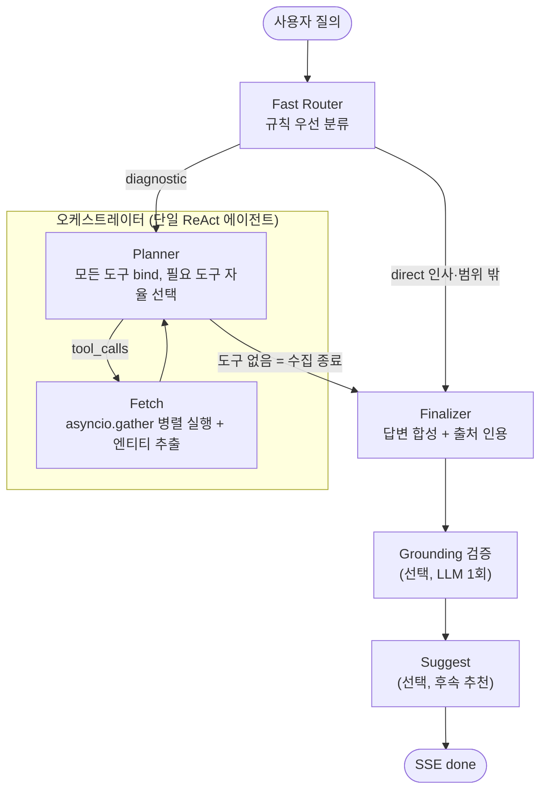

# Agent 아키텍처 설계 (AI_AGENT01_REACT01)

이 문서는 자연어 질의를 자율 추론으로 처리하는 에이전트 계층의 설계를 설명합니다.
질의는 먼저 Fast Router가 규칙으로 분류하고, 데이터 수집이 필요한 질의는 오케스트레이터가
도구를 자율 선택해 병렬로 실행한 뒤 관찰 결과로 재판단하는 ReAct 루프를 돕니다. 그래프는
LangGraph로 직접 구성합니다.

## 두 오케스트레이션 경로

진단 경로는 설정 플래그 `agent_orchestrator_enabled`로 두 구현이 공존합니다. 신규 기본 목표는
하이브리드 오케스트레이터이고, 레거시 경로는 되돌림 지점과 A/B 비교를 위해 남겨 둡니다.

| 경로 | 구조 | 플래그 |
| --- | --- | --- |
| 하이브리드 오케스트레이터 (신규) | 단일 ReAct 에이전트(Planner) + 병렬 Fetch | `agent_orchestrator_enabled=true` |
| 레거시 동적 라우팅 | Supervisor + 워커별 ReAct 서브그래프 | `agent_orchestrator_enabled=false` (현재 기본값) |

플래그 기본값이 `false`라 운영 기본 경로는 아직 레거시이며, 시나리오 3.2 골든 검증과 RAG
정상화 확인 후 기본값을 전환할 예정입니다. Fast Router와 Finalizer 계열 종료 노드는 두 경로가
공유합니다.

## 에이전트 사용 지점

에이전트 계층은 두 형태로 쓰입니다. 하나는 챗봇의 질의 응답 흐름이고, 다른 하나는 다른 모듈이
필요할 때 호출하는 경량 LLM 보조 기능입니다. 보조 기능은 그래프를 돌지 않고 단발 구조화
출력(또는 도구 1회 호출)으로 동작하며, 실패해도 빈 결과·기본값으로 격리해 주 응답에 지장을
주지 않습니다.

| 사용 지점 | 형태 | 호출 위치 | 기능 ID |
| --- | --- | --- | --- |
| 챗봇 질의 응답 | Fast Router + 오케스트레이터(또는 레거시 Supervisor) | chat 스트리밍 | AI_AGENT01_REACT01 |
| 장비 추천 | 경량 LLM 1회 구조화 출력 | telemetry 장비 상세 | NEW_TWIN01_SUGGEST01 |
| 후속 추천 질문 | 경량 LLM 1회 구조화 출력 | chat done 직후 | BE_CHAT02_SUGGEST01 |
| 장애 대응 계획 | LLM + knowledge MCP 도구 | incident 계획 생성 | NEW_INCIDENT01_PLAN01 |

이 문서 §1~§9는 챗봇 질의 응답 흐름을 다루며, 보조 기능은 `llm/base.py`(챗 모델 팩토리)와
`mcp_client`(도구 로드)를 재사용하는 단발 호출이라 그래프 조립과 무관합니다.

## 1. 전체 구조



- Fast Router는 규칙으로 잡담·범위 밖 질의를 판별해 Finalizer로 직행시키고, 데이터 수집이
  필요한 질의만 오케스트레이터에 넘깁니다(§4.1).
- Planner는 모든 MCP 도구를 bind한 단일 에이전트로, 라운드마다 필요한 도구를 스스로 골라
  호출합니다. 독립 근거는 한 번에 병렬 호출하고, 앞선 결과에 의존하는 근거는 관찰 후 다음
  라운드에 호출합니다(팀 레벨 ReAct, §4.2).
- Fetch는 Planner가 emit한 도구 호출을 `asyncio.gather`로 병렬 실행합니다. Planner가 도구를
  더 부르지 않으면 수집이 끝난 것으로 보고 Finalizer로 넘어갑니다.
- 레거시 경로는 Supervisor가 매 턴 워커를 동적 라우팅하고 각 워커가 agent·tool 왕복으로
  ReAct 루프를 도는 구조이며, 같은 종료 노드(Finalizer 계열)를 공유합니다.

## 2. 기술 선택 비교

### 2.1 오케스트레이션 방식

| 항목 | 고정 파이프라인 | 동적 Supervisor 반복 라우팅 | 선택안: 하이브리드 단일 ReAct |
| --- | --- | --- | --- |
| 다음 단계 결정 | 코드 | 매 턴 라우팅 LLM | Planner 1회 + 재판단(ReAct) |
| Fetch 실행 | 직렬 | 직렬 | 병렬 (asyncio.gather) |
| 자율 도구 선택·재판단 | 미충족 | 충족 | 충족 (예산 config) |
| 질의당 LLM 호출 | 최소 | 라우팅 N + 워커 스텝 N | Planner 1~3 + Finalizer 1 |
| 예측 가능성·재현성 | 높음 | 낮음 | 높음 |

선택 근거: REQ-T-01/FR-01은 도구 선택·결과 해석·추가 호출의 자율 수행을 요구합니다. 고정
파이프라인은 이를 충족하지 못하고, 동적 반복 라우팅은 충족하지만 라우팅 왕복이 직렬로 쌓이고
매 호출마다 히스토리를 재전송해 지연·비용이 과합니다. 하이브리드는 단일 에이전트의 병렬 도구
호출과 제한적 재판단으로 자율성을 유지하면서 왕복 수와 토큰을 줄입니다. 재판단 횟수는
하드코딩하지 않고 `agent_fetch_rounds_max`로 조정합니다.

### 2.2 측정 결과

`scripts/bench/agent_arch_bench.py`로 신·구 경로를 같은 워크로드에서 비교했습니다. 모든 도구를
결정적 스텁으로 대체하고 모의 지연을 주입해, RAG 품질·DB 시드와 무관하게 아키텍처 차이만
측정합니다. 질의 3종 x 3회로 각 n=9입니다.

| 지표 | 레거시 (Supervisor+워커) | 오케스트레이터 | 개선 폭 |
| --- | --- | --- | --- |
| 평균 지연 | 56.4s | 15.4s | -72.7% |
| LLM 호출/질의 | 9.3회 | 3.1회 | -66.7% |
| 입력 토큰/질의 | 19,612 | 3,305 | -83.1% |
| 질의당 비용 | $0.0136 | $0.0035 | -74.6% |

## 3. 상태 (AgentState)

| 필드 | 용도 | 관련 기능 ID |
| --- | --- | --- |
| `messages` | 대화·추론 누적 (add_messages) | - |
| `intent` | Fast Router 분류 결과 (direct·diagnostic) | AI_AGENT01_REACT01 |
| `entities` | Observation에서 추출한 컨텍스트 장부 | AI_AGENT02_CHAIN01 |
| `step_count` | 전역 반복 예산 (레거시 라우팅·Planner 라운드 공용) | AI_AGENT03_FALLBACK01 |
| `tool_history` | 실행된 도구 시그니처, 동일 호출 반복 차단 | AI_AGENT03_FALLBACK01 |
| `next` | 레거시 Supervisor가 정한 다음 목적지 | 라우팅 |
| `citations` | 답변 근거 (doc_id·데이터 기준 시각) | NEW_TRUST01_CITE01 |
| `grounded` | Grounding 자가 검증 결과 | NEW_TRUST02_GROUND01 |
| `suggested_questions` | 후속 추천 질문 | BE_CHAT02_SUGGEST01 |

## 4. 핵심 설계 결정

### 4.1 Fast Router + Direct Answer (#139)

인사·감사·잡담이거나 시스템 범위 밖 질의는 데이터 수집이 필요 없습니다. Fast Router는 마지막
사용자 발화를 규칙(정규식)으로 분류해, 진단 신호(설비·알람·EQP-·이상·원인 등)가 없고 잡담
신호만 있으면 `direct`로 판정하고 Finalizer로 직행시킵니다. LLM 라우팅 호출을 아예 태우지
않아 해당 질의군의 지연·비용을 제거합니다. `direct` 오탐은 데이터 누락으로 직결되므로 고정밀
기준을 적용하고, 애매하면 `diagnostic`으로 유지합니다. 설정 `agent_fast_router_enabled`로
on/off 합니다.

### 4.2 오케스트레이터: 단일 ReAct 에이전트 + 병렬 Fetch (#139)

Planner는 모든 MCP 도구를 bind한 하나의 에이전트로, Supervisor 라우팅과 워커 선택을 한
노드로 합칩니다. 라운드마다 필요한 도구를 스스로 골라 emit하고, Fetch가 이를 병렬 실행한 뒤
관찰 결과를 대화에 추가합니다. Planner는 다음 라운드에 재판단하며, 도구를 더 부르지 않으면
수집을 종료합니다.

```python
# supervisor/orchestrator.py
make_planner_node(llm, all_tools, rounds_max)  # 필요 도구 자율 선택, 라운드 예산 소진 시 종료
make_fetch_node(all_tools)                     # tool_calls를 asyncio.gather로 병렬 실행
route_after_planner(state)                      # 도구 있으면 Fetch, 없으면 Finalizer
```

- 독립 근거(예: 센서 로그와 정비 이력)는 한 라운드에 함께 호출해 병렬로 겹칩니다.
- 앞선 결과(설비 ID·알람 코드)에 의존하는 근거는 관찰 후 다음 라운드에 호출합니다. 이 재판단이
  ReAct 루프이며, 시나리오 3.2의 Thought 2에 해당합니다(§6).
- 재판단 라운드 예산은 `agent_fetch_rounds_max`(기본 3)로 두고, 소진 시 LLM 호출 없이 확보된
  근거로 종료합니다.

### 4.3 컨텍스트 장부: 도구 연쇄 (AI_AGENT02_CHAIN01)

Fetch가 Observation에서 핵심 엔티티(equipment_id·alarm_code)를 추출해 상태의 `entities`에
누적하고, 다음 Planner 라운드의 시스템 프롬프트에 "현재 파악된 컨텍스트" 블록으로 주입합니다.
LLM이 긴 히스토리를 재해석하는 데 기대지 않고 연쇄를 구조적으로 보장합니다. 레거시 워커도 같은
장부를 공유합니다.

### 4.4 폴백 (AI_AGENT03_FALLBACK01)

| 계층 | 장치 | 동작 |
| --- | --- | --- |
| 전역 | Planner 라운드 예산 + recursion_limit | 초과 시 LLM 없이 Finalizer로 종료, 부분 결과 답변 |
| 도구 | 호출 실패 격리 | 실패를 Observation으로 주입, 다음 판단에 반영 |
| 반복 | 동일 도구+인자 해시 감지 | 같은 호출 차단, "이미 시도한 호출" 피드백 주입 |

세 계층이 겹쳐 있어 무한 루프가 구조적으로 발생하지 않습니다. 레거시 경로는 전역 예산으로
`agent_max_steps`를 사용합니다.

### 4.5 Finalizer + Grounding (신규-신뢰성)

- Finalizer: 수집된 Observation에서 `doc_id`(knowledge)와 데이터 기준 시각(realtime)을 모아
  출처 인용(NEW_TRUST01_CITE01)을 답변에 부착합니다.
- Grounding 노드: 답변이 수집 컨텍스트에 근거하는지 LLM 1회로 판정하고 `done` 이벤트의
  `grounded` 배지로 표시합니다(NEW_TRUST02_GROUND01). 설정으로 on/off 가능하며 검증 호출이
  실패해도 답변은 정상 전달됩니다.

### 4.6 스트리밍: SSE 계약과 매핑

`graph.astream`의 이벤트를 `agentory.common.events` 계약으로 변환하는 단일 변환기
(`streaming.py`)를 둡니다. SSE 이벤트 스키마(events.py)는 두 경로가 동일하며, 오케스트레이터
경로는 노드 산출물을 같은 이벤트 타입으로 매핑합니다.

| 그래프 산출물 | SSE 이벤트 |
| --- | --- |
| Planner 판단 문장 | `thought` |
| Planner tool_calls | `action` (도구→서버→AgentName 매핑) |
| Fetch 결과(ToolMessage) | `observation` (도구별 agent) |
| Finalizer 토큰 스트림 | `answer` (delta) |
| 그래프 종료 | `done` (citations·grounded·suggested) |

단일 Planner 노드로 합쳐도 도구가 속한 서버로 `AgentName`을 채워 도메인 라벨(data_analysis·
knowledge·maintenance)을 유지하므로, 프론트가 보는 계약은 레거시와 동일합니다.

### 4.7 모델 이원화 (비용·지연 최적화)

| 역할 | 모델 | 근거 |
| --- | --- | --- |
| Fast Router | 없음 (규칙) | 규칙 분류라 LLM 미사용 |
| Planner | 균형형 모델 (worker) | 도구 인자 구성 품질 필요 |
| Finalizer | 고성능 모델 | 종합 답변 품질 |

역할별 모델은 환경 변수(LLM_MODEL·LLM_ROUTER_MODEL·LLM_FINALIZER_MODEL)로 분리 선택하고,
미설정 역할은 LLM_MODEL로 폴백합니다. LLM은 실제 쓰는 경로에서만 지연 생성해 미사용 역할의
불필요한 클라이언트 생성을 피합니다.

### 4.8 설정 플래그

| 키 | 기본값 | 용도 |
| --- | --- | --- |
| `agent_fast_router_enabled` | true | 잡담·범위 밖 질의 Direct Answer 바이패스 |
| `agent_orchestrator_enabled` | false | 진단 경로를 오케스트레이터로 전환 |
| `agent_fetch_rounds_max` | 3 | Planner 재판단(ReAct) 라운드 예산 |
| `agent_max_steps` | 6 | 레거시 Supervisor 위임 예산 |
| `agent_grounding_enabled` | false | Grounding 자가 검증 on/off |
| `agent_suggestions_enabled` | true | 후속 추천 질문 생성 on/off |

## 5. 패키지 배치

```
modules/agent/
├── supervisor/
│   ├── state.py         # AgentState
│   ├── fast_router.py   # 규칙 분류 + Direct Answer 바이패스 (#139)
│   ├── orchestrator.py  # Planner + 병렬 Fetch + 재판단 (#139)
│   ├── router.py        # 레거시 Supervisor 노드 (구조화 라우팅 + 폴백)
│   ├── finalizer.py     # 최종 답변 + 출처 인용, Grounding 노드
│   ├── suggest.py       # 후속 추천 질문 보조 (BE_CHAT02_SUGGEST01)
│   └── graph.py         # 전체 조립 build_agent_graph(), 경로 분기
├── workers/
│   ├── base.py          # 레거시 워커 ReAct 팩토리
│   └── registry.py      # WorkerSpec 등록부
├── mcp_client/client.py # 서버별 MCP 도구 로드
├── llm/base.py          # 챗 모델 팩토리 (역할별 이원화)
├── context.py           # 엔티티 추출·컨텍스트 장부 (AI_AGENT02_CHAIN01)
├── streaming.py         # astream → SSEEvent 변환기
├── runner.py            # 그래프·도구 agent 매핑 캐시, 초기 상태
├── equipment_suggest.py # 장비 상태 기반 추천 보조 (NEW_TWIN01_SUGGEST01)
└── prompts/             # 오케스트레이터·워커별·보조 프롬프트
```

챗봇 외 보조 기능은 그래프를 거치지 않고 `llm/base.py`·`mcp_client`를 재사용합니다.

## 6. 시나리오 3.2 워크스루 (오케스트레이터 경로)

1. "최근 1시간 B라인에서 이상 징후 설비 찾고 원인·조치 알려줘" 수신, Fast Router가 진단 신호를
   감지해 `diagnostic`으로 오케스트레이터에 위임
2. Planner Thought 1: 이상 설비 특정에 실시간 데이터가 필요하다고 판단, `get_sensor_logs`·
   `get_alarm_history`를 한 라운드에 emit
3. Fetch가 두 도구를 병렬 실행, EQP-003 온도 65°C·ERR-402 다발 확인, 장부에
   `{equipment_id: EQP-003, alarm_code: ERR-402}` 적재
4. Planner Thought 2(재판단): 원인·조치에 매뉴얼이 필요하다고 판단, 장부의 알람 코드로
   `search_manuals("ERR-402 냉각수")` 호출
5. Fetch가 MAN-ETC-042 확보, Planner가 근거 충분으로 판단해 도구 없이 종료
6. Finalizer가 센서 추이 표 + 조치 요약 + 인용(MAN-ETC-042·데이터 기준 시각) 생성,
   Grounding `grounded=true`
7. 전 과정이 SSE로 Thought UI에 실시간 노출(thought·action·observation·answer)

## 7. 테스트 전략

- 스크립트된 FakeChatModel로 그래프 로직(분류·병렬 Fetch·재판단 예산·엔티티 추출)을 API 키
  없이 결정론적으로 단위 검증합니다.
- 아키텍처 A/B 벤치(`scripts/bench/agent_arch_bench.py`)는 도구 스텁+모의 지연으로 RAG와
  무관하게 지연·호출·토큰을 실측합니다.
- 골든 시나리오 E2E는 시뮬레이터 주입 + 실제 LLM으로 선택 실행합니다.
- SSE 변환기는 계약 테스트(tests/contracts)로 검증합니다.

## 8. 구현 단계

| 단계 | 내용 | 상태 |
| --- | --- | --- |
| 1 | Fast Router + Direct Answer 바이패스 | 완료 (#139) |
| 2 | Planner + 병렬 Fetch + 재판단 예산 + SSE 매핑 | 완료 (#139) |
| 검증 | 아키텍처 A/B 벤치 실측 | 완료 (#139) |
| 3 | Evidence Store 정규화 + Finalizer 입력 축소 | 예정 |
| 4 | 시나리오 3.2 골든 E2E + 플래그 전환 | 예정 |

## 9. 요구사항 매핑

| 기능 ID | 반영 위치 |
| --- | --- |
| AI_AGENT01_REACT01 | Planner↔Fetch 재판단 루프 (orchestrator.py), 레거시 워커 (workers/base.py) |
| AI_AGENT01_PROMPT01 | prompts/orchestrator.py (Planner), prompts/ (워커별) |
| AI_AGENT02_CHAIN01 | context.py 컨텍스트 장부 |
| AI_AGENT03_FALLBACK01 | 3중 폴백 (§4.4) |
| NEW_TRUST01_CITE01 | Finalizer 출처 인용 |
| NEW_TRUST02_GROUND01 | finalizer.py Grounding 노드 |
| NEW_TRUST03_REASON01 | Planner thought·action SSE 노출 |
| FR-09 (Thought UI) | streaming.py SSE 변환 |
| NEW_TWIN01_SUGGEST01 | equipment_suggest.py |
| BE_CHAT02_SUGGEST01 | supervisor/suggest.py |
| NEW_INCIDENT01_PLAN01 | incident/service.py (llm/base·knowledge MCP 재사용) |
| BE_MCP05_MAINT01 | mcp_maintenance 서버 + maintenance 도구 (정비 이력) |

## 관련 문서

- MCP 서버: [../mcp/](../mcp/)
- SSE 이벤트 계약: [../sse-events.md](../sse-events.md)
- 아키텍처 결정 기록: [../adr/0001-architecture.md](../adr/0001-architecture.md)
- 아키텍처 A/B 벤치: [../../scripts/bench/agent_arch_bench.py](../../scripts/bench/agent_arch_bench.py)
