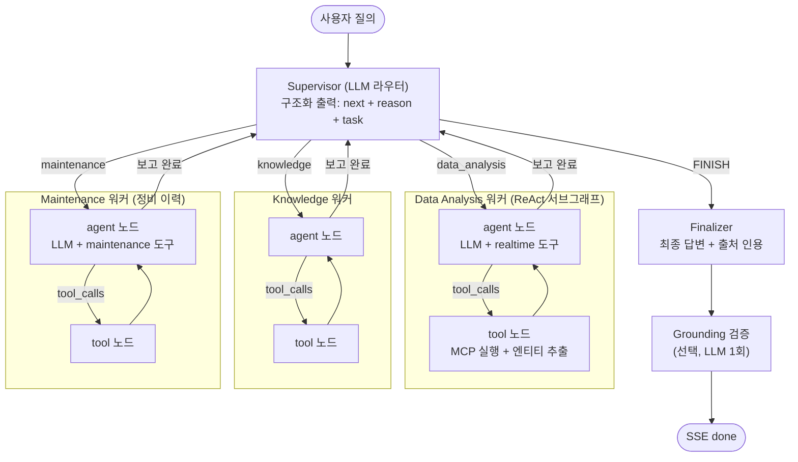

# Agent 아키텍처 설계 (AI_AGENT01_REACT01)

이 문서는 자연어 질의를 자율 추론으로 처리하는 에이전트 계층의 설계를 설명합니다.
Supervisor가 워커를 동적으로 라우팅하고, 각 워커가 MCP 도구를 ReAct 루프로 호출하는
구조이며, LangGraph로 그래프를 직접 구성합니다.

## 에이전트 사용 지점

에이전트 계층은 두 형태로 쓰입니다. 하나는 챗봇의 Supervisor+ReAct 멀티턴 흐름이고,
다른 하나는 다른 모듈이 필요할 때 호출하는 경량 LLM 보조 기능입니다. 보조 기능은 그래프를
돌지 않고 단발 구조화 출력(또는 도구 1회 호출)으로 동작하며, 실패해도 빈 결과·기본값으로
격리해 주 응답에 지장을 주지 않습니다.

| 사용 지점 | 형태 | 호출 위치 | 기능 ID |
| --- | --- | --- | --- |
| 챗봇 질의 응답 | Supervisor+ReAct 멀티턴 (data_analysis·knowledge·maintenance 워커) | chat 스트리밍 | AI_AGENT01_REACT01 |
| 장비 추천 | 경량 LLM 1회 구조화 출력 | telemetry 장비 상세 | NEW_TWIN01_SUGGEST01 |
| 후속 추천 질문 | 경량 LLM 1회 구조화 출력 | chat done 직후 | BE_CHAT02_SUGGEST01 |
| 장애 대응 계획 | LLM + knowledge MCP 도구 | incident 계획 생성 | NEW_INCIDENT01_PLAN01 |

이 문서 §1~§8은 챗봇 Supervisor+ReAct 흐름을 다루며, 보조 기능은 `llm/base.py`(챗 모델
팩토리)와 `mcp_client`(도구 로드)를 재사용하는 단발 호출이라 그래프 조립과 무관합니다.

## 1. 전체 구조



- Supervisor는 매 턴 워커 보고를 보고 다음 행동을 재판단합니다(팀 레벨 ReAct).
- 각 워커는 agent 노드와 tool 노드의 조건부 왕복으로 ReAct 루프
  (Thought → Action → Observation)를 직접 구현합니다. prebuilt(`create_react_agent`)를
  사용하지 않습니다.

## 2. 기술 선택 비교

### 2.1 중앙 제어 방식

| 항목 | 고정 파이프라인 | 플래너(Plan-and-Execute) | 선택안: Supervisor 동적 라우팅 |
| --- | --- | --- | --- |
| 다음 단계 결정 | 코드 | 초기 계획 | 매 턴 LLM |
| 중간 결과 적응 | 불가 | 재계획 로직 필요 | 구조 자체가 적응 |
| LLM 호출 수 | 최소 | 계획 1 + 단계 N | 라우팅 N + 단계 N |
| 예측 가능성 | 높음 | 중 | 낮음 (가드로 보완) |
| REQ-T-01(자율 도구 선택) 충족 | 미충족 위험 | 부분 | 충족 |

선택 근거: REQ-T-01/FR-01은 도구 선택·결과 해석·추가 호출의 자율 수행을 요구합니다.
또한 진단 질의는 조회 전에는 대상 설비를 알 수 없는 탐색적 문제이므로, 관찰 후 재판단하는
동적 라우팅이 자연스럽습니다. 동적 방식의 약점(예측 불가능성·호출 수)은 규칙 가드와 모델
이원화로 상쇄합니다(§4 참조). 즉 본 설계는 동적 Supervisor를 결정론적 가드레일로 감싼
하이브리드 오케스트레이션입니다.

### 2.2 에이전트 구조·구현 방식

| 항목 | 단일 ReAct 에이전트 | 선택안: Supervisor + 워커 |
| --- | --- | --- |
| 구현 난이도 | 낮음 | 중 |
| 도구 증가 시 프롬프트 부담 | 도구 전부 한 프롬프트 | 워커별 분리 |
| 팀 분업(워커별 담당) | 어려움 | 담당 경계와 1:1 |
| 멀티에이전트 협업 시연 | 불가 | 가능 |

| 항목 | prebuilt(create_react_agent 등) | 선택안: 직접 그래프 구성 |
| --- | --- | --- |
| 구현 속도 | 빠름 | 느림 |
| ReAct 루프 직접 구현 어필 | 약함 | 강함 (요구사항 부합) |
| 폴백·이벤트 커스터마이징 | 제약 | 자유 |

## 3. 상태 (AgentState)

| 필드 | 용도 | 관련 기능 ID |
| --- | --- | --- |
| `messages` | 대화·추론 누적 (add_messages) | - |
| `entities` | Observation에서 추출한 컨텍스트 장부 | AI_AGENT02_CHAIN01 |
| `step_count` | Supervisor 위임 예산 (워커 ReAct 턴 제외) | AI_AGENT03_FALLBACK01 |
| `next` | Supervisor가 정한 다음 목적지 | 라우팅 |
| `citations` | 답변 근거 (doc_id·데이터 기준 시각) | NEW_TRUST01_CITE01 |

## 4. 핵심 설계 결정

### 4.1 워커 팩토리 + 레지스트리

ReAct 루프 구현은 `workers/base.py`의 팩토리 한 곳에만 존재하며, 워커는 스펙 등록만으로
추가됩니다.

```python
# workers/base.py: ReAct 직접 구현은 이 팩토리 한 곳
build_react_worker(name, llm, tools, system_prompt) -> CompiledGraph

# workers/registry.py: 팀원은 스펙만 등록
WORKERS = {
    "data_analysis": WorkerSpec(server="realtime",    prompt=DA_PROMPT),
    "knowledge":     WorkerSpec(server="knowledge",   prompt=KN_PROMPT),
    "maintenance":   WorkerSpec(server="maintenance", prompt=MT_PROMPT),
}
```

워커 담당자(Data Analysis·Knowledge·Maintenance)는 프롬프트와 도구 서버 지정만 작성하면 되고,
Supervisor·루프 코드는 수정하지 않습니다. 역할 분담이 코드 구조와 일치합니다.

### 4.2 Supervisor 구조화 라우팅

Supervisor는 매 턴 Pydantic 스키마로 강제된 구조화 출력을 생성합니다.

```python
class Route(BaseModel):
    next: Literal["data_analysis", "knowledge", "maintenance", "FINISH"]
    reason: str   # 이 워커를 선택한 근거
    task: str     # 워커에게 전달할 구체 지시
```

- `reason`은 SSE `thought` 이벤트와 도구 선택 근거 노출(NEW_TRUST03_REASON01) 데이터로
  그대로 사용됩니다.
- 구조화 출력 파싱 실패 시 결정론적 폴백을 적용합니다(첫 턴이면 data_analysis, 예산 소진
  시 FINISH).

### 4.3 컨텍스트 장부: 도구 연쇄 (AI_AGENT02_CHAIN01)

tool 노드가 Observation에서 핵심 엔티티(equipment_id·alarm_code·시간창)를 추출해 상태의
`entities`에 누적하고, 다음 워커의 시스템 프롬프트에 "현재 파악된 컨텍스트" 블록으로
주입합니다. LLM이 긴 히스토리를 재해석하는 데 기대지 않고 연쇄를 구조적으로 보장하며,
워커에는 전체 히스토리 대신 요약과 장부만 전달해 토큰을 절감합니다.

### 4.4 3중 폴백 (AI_AGENT03_FALLBACK01)

| 계층 | 장치 | 동작 |
| --- | --- | --- |
| 전역 | step 예산(기본 6, Supervisor 위임 기준) + recursion_limit | 초과 시 Finalizer로 강제 이동, 부분 결과 + 한계 명시 답변 |
| 도구 | 호출 실패 1회 재시도 | 재실패 시 에러를 Observation으로 주입, LLM이 대안 선택 |
| 반복 | 동일 도구+인자 해시 감지 | 같은 호출 반복 차단, "이미 시도한 호출" 피드백 주입 |

세 계층이 겹쳐 있어 무한 루프가 구조적으로 발생하지 않습니다. `step_count`는 Supervisor 위임 횟수만
세며 워커 내부 ReAct 턴은 증가시키지 않습니다(feature/130 #131). 초기에는 워커 턴도 함께 세어 워커
하나가 예산을 소진하고 후속 워커가 잘리는 문제가 있었고, 워커 3종 도입 시점에 이를 분리했습니다(3워커
심층 질의 step_count 8→3, 예산 값 4→6). 배경·실측은 [ADR-0003 §5](../adr/0003-agent-runtime-budget.md)에 있습니다.

### 4.5 Finalizer + Grounding (신규-신뢰성)

- Finalizer: 수집된 Observation에서 `doc_id`(knowledge)와 데이터 기준 시각(realtime)을
  모아 출처 인용(NEW_TRUST01_CITE01)을 답변에 부착합니다.
- Grounding 노드: 답변이 수집 컨텍스트에 근거하는지 LLM 1회 추가 호출로 판정하고
  `done` 이벤트의 `grounded` 배지로 표시합니다(NEW_TRUST02_GROUND01). 설정으로
  on/off 가능하며, 검증 호출이 실패해도 답변은 정상 전달됩니다.

### 4.6 스트리밍: SSE 계약과 1:1 매핑

`graph.astream_events`의 이벤트를 `agentory.common.events` 계약으로 변환하는 단일
변환기(`streaming.py`)를 둡니다.

| 그래프 이벤트 | SSE 이벤트 |
| --- | --- |
| Supervisor Route 산출 | `thought` (reason 포함) |
| 워커 LLM의 tool_calls | `action` (tool·input·reason) |
| tool 노드 실행 결과 | `observation` |
| Finalizer 토큰 스트림 | `answer` (delta) |
| 그래프 종료 | `done` (citations·grounded) |

전체 추론 기록은 `chat_message.trace`(jsonb)에 저장하여 Thought UI 재조회와 평가 데이터로
재사용합니다.

### 4.7 모델 이원화 (비용·지연 최적화)

| 역할 | 모델 | 근거 |
| --- | --- | --- |
| Supervisor 라우팅 | 경량 모델 (설정) | 짧은 구조화 판단, 매 턴 호출되어 지연 민감 |
| 워커·Finalizer | 고성능 모델 | 도구 인자 구성·종합 답변 품질 |

질의당 LLM 호출은 약 5~7회이며 그중 라우팅 2~3회를 경량 모델로 분리하면 해당 호출의
비용·지연을 크게 낮출 수 있습니다. 기본값은 단일 모델이고 환경 변수로 분리 가능합니다.

## 5. 패키지 배치

```
modules/agent/
├── supervisor/
│   ├── state.py        # AgentState
│   ├── router.py       # Supervisor 노드 (구조화 라우팅 + 폴백 가드)
│   ├── finalizer.py    # 최종 답변 + 출처 인용
│   ├── grounding.py    # 자가 검증 노드 (NEW_TRUST02_GROUND01)
│   ├── suggest.py      # 후속 추천 질문 보조 (BE_CHAT02_SUGGEST01)
│   └── graph.py        # 전체 조립 build_agent_graph()
├── workers/
│   ├── base.py         # build_react_worker 팩토리 (ReAct 직접 구현)
│   └── registry.py     # WorkerSpec 등록부 (워커 추가 지점)
├── mcp_client/client.py  # langchain-mcp-adapters로 서버별 도구 로드
├── llm/base.py         # 챗 모델 팩토리 (라우터/워커 이원화)
├── context.py          # 엔티티 추출·컨텍스트 장부 (AI_AGENT02_CHAIN01)
├── streaming.py        # astream_events → SSEEvent 변환기 (3단계)
├── equipment_suggest.py  # 장비 상태 기반 추천 보조 (NEW_TWIN01_SUGGEST01)
└── prompts/            # supervisor.py + 워커별·보조 프롬프트 (각 담당 소유 파일)
```

챗봇 외 보조 기능은 그래프를 거치지 않고 `llm/base.py`·`mcp_client`를 재사용합니다. 장비 추천은
telemetry 서비스가 `equipment_suggest`를 호출하고, 장애 대응 계획(NEW_INCIDENT01_PLAN01)은
incident 서비스가 `llm/base.py`·`mcp_client`를 직접 사용합니다.

추가 의존성: `langchain-openai`(ChatOpenAI), `langchain-mcp-adapters`(MCP 도구 로드)

LLM은 OpenAI를 사용하며, 역할별로 모델을 분리 선택합니다(LLM_MODEL·LLM_ROUTER_MODEL·
LLM_FINALIZER_MODEL). 미설정 역할은 LLM_MODEL로 폴백합니다.

## 6. 시나리오 3.2 워크스루

1. "최근 1시간 B라인에서 이상 징후 설비 찾고 원인·조치 알려줘" 수신, Supervisor가
   `next=data_analysis, reason="이상 설비 특정에 센서 로그 필요"` 산출
2. Data Analysis 워커 ReAct: `get_sensor_logs(line_name=B-Line)` → EQP-003 온도 65°C 확인
   → `get_alarm_history(EQP-003)` → ERR-402 다발 확인 → 보고. 장부에
   `{equipment_id: EQP-003, alarm_code: ERR-402}` 적재
3. Supervisor가 `next=knowledge, task="ERR-402 원인·조치 검색"` 산출, 장부가 검색어 구성에
   주입됨(도구 연쇄)
4. Knowledge 워커: `search_manuals("ERR-402 냉각수")` → MAN-ETC-042 확보
5. Supervisor `FINISH` → Finalizer가 센서 추이 표 + 조치 요약 + 인용(MAN-ETC-042,
   데이터 기준 시각) 생성 → Grounding `grounded=true`
6. 전 과정이 SSE로 Thought UI에 실시간 노출

## 7. 테스트 전략

- 스크립트된 FakeChatModel로 그래프 로직(라우팅·폴백·반복 차단·엔티티 추출)을 API 키 없이
  결정론적으로 단위 검증합니다.
- 골든 시나리오 E2E는 시뮬레이터 주입 + 실제 LLM으로 선택 실행합니다.
- SSE 변환기는 기존 계약 테스트(tests/contracts)에 케이스를 추가해 검증합니다.

## 8. 구현 단계

| 단계 | 내용 | 비고 |
| --- | --- | --- |
| 1 | MCP 클라이언트 + State + 워커 팩토리(ReAct) + Supervisor 라우터 + 그래프 조립 | 골격 |
| 2 | data_analysis 워커 + 컨텍스트 장부 + 폴백 3종 | Supervisor 담당분 |
| 3 | Finalizer·Grounding·스트리밍 + 채팅 API 연결 | 시나리오 E2E |
| 4 | knowledge 워커 | 담당자가 레지스트리에 등록 |

## 9. 요구사항 매핑

| 기능 ID | 반영 위치 |
| --- | --- |
| AI_AGENT01_REACT01 | 워커 agent↔tool 왕복 (workers/base.py) |
| AI_AGENT01_PROMPT01 | prompts/ (Supervisor + 워커별) |
| AI_AGENT02_CHAIN01 | context.py 컨텍스트 장부 |
| AI_AGENT03_FALLBACK01 | 3중 폴백 (§4.4) |
| NEW_TRUST01_CITE01 | Finalizer 출처 인용 |
| NEW_TRUST02_GROUND01 | grounding.py |
| NEW_TRUST03_REASON01 | Route.reason → SSE thought/action |
| FR-09 (Thought UI) | streaming.py SSE 변환 |
| NEW_TWIN01_SUGGEST01 | equipment_suggest.py (장비 상태 기반 추천, telemetry 호출) |
| BE_CHAT02_SUGGEST01 | supervisor/suggest.py (후속 추천 질문) |
| NEW_INCIDENT01_PLAN01 | incident/service.py (llm/base·knowledge MCP 재사용) |
| BE_MCP05_MAINT01 | mcp_maintenance 서버 + maintenance 워커 (정비 이력) |

## 관련 문서

- MCP 서버: [../mcp/](../mcp/)
- SSE 이벤트 계약: [../sse-events.md](../sse-events.md)
- 아키텍처 결정 기록: [../adr/0001-architecture.md](../adr/0001-architecture.md)
