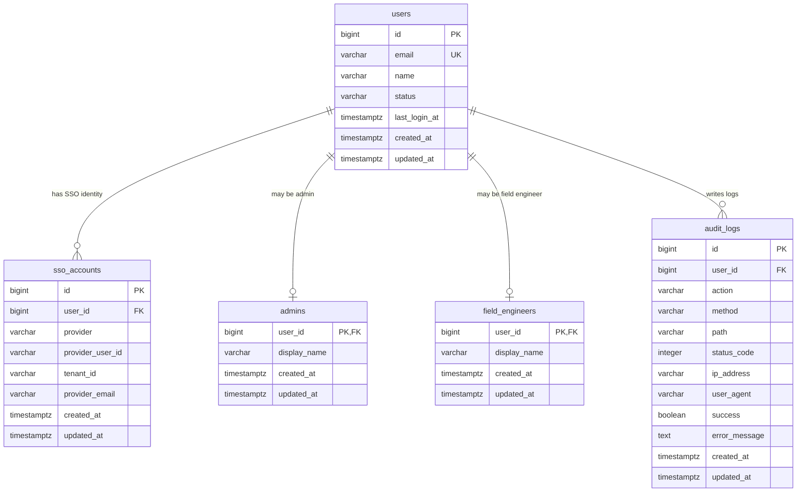
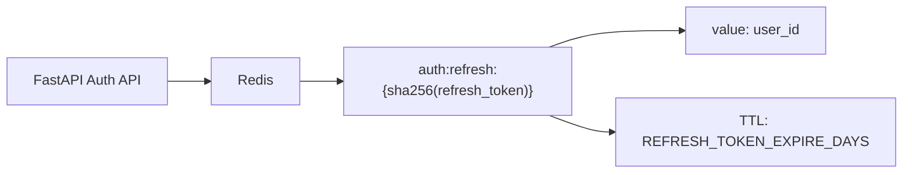

# Azure AD SSO 인증/인가 DB 설계

## 설계 기준

이 프로젝트의 로그인은 Azure AD / Microsoft Entra ID SSO를 1차 인증 수단으로 사용한다. 사용자는 최초 SSO 로그인 시 `users`에 공통 계정으로 자동 등록되고, 업무 구분에 따라 `admins` 또는 `field_engineers` 중 하나의 프로필 테이블에 연결된다.

- 인증: Azure AD / Microsoft Entra ID SSO
- 회원가입: Azure AD 최초 로그인 성공 시 자동 등록
- 비밀번호 찾기: 로컬 비밀번호 재설정이 아니라 Azure AD 비밀번호 재설정 URL 안내
- 인가: `admins`, `field_engineers` 테이블 존재 여부로 판단
- 관리자와 현장 엔지니어는 분리된 사용자 유형
- 관리자는 `field_engineers`에 포함하지 않음
- refresh token은 DB가 아니라 Redis TTL 캐시에 저장
- audit log는 Redis가 아니라 DB의 독립 테이블에 저장
- 모든 주요 테이블은 공통 timestamp인 `created_at`, `updated_at`을 사용

## ERD



## Redis 캐시 구조

Redis는 ERD의 RDB 테이블이 아니라 refresh token 저장용 캐시 계층이다.



## 테이블 명세

### users

Azure AD SSO로 인증된 내부 공통 사용자 계정이다. 관리자와 현장 엔지니어 모두 먼저 `users`에 생성된다.

| 컬럼 | 타입 | 제약조건 | 설명 |
| --- | --- | --- | --- |
| id | bigint | PK | 내부 사용자 ID |
| email | varchar(255) | not null, unique, index | 사용자 이메일 |
| name | varchar(100) | not null | 사용자 이름 |
| status | varchar(20) | not null, default `ACTIVE` | 계정 상태 |
| last_login_at | timestamptz | nullable | 마지막 로그인 시각 |
| created_at | timestamptz | not null | 생성 시각 |
| updated_at | timestamptz | not null | 수정 시각 |

### sso_accounts

Azure AD 계정과 내부 사용자 계정을 연결하는 테이블이다. 한 사용자는 여러 SSO 계정을 가질 수 있도록 1:N 구조로 열어둔다.

| 컬럼 | 타입 | 제약조건 | 설명 |
| --- | --- | --- | --- |
| id | bigint | PK | SSO 계정 ID |
| user_id | bigint | FK -> users.id, index | 내부 사용자 ID |
| provider | varchar(30) | not null | 현재 값은 `azure_ad` |
| provider_user_id | varchar(255) | not null | Azure AD `oid` 또는 `sub` |
| tenant_id | varchar(255) | not null | Azure tenant ID |
| provider_email | varchar(255) | not null | Azure 계정 이메일 |
| created_at | timestamptz | not null | 생성 시각 |
| updated_at | timestamptz | not null | 수정 시각 |

Unique:

```text
(provider, provider_user_id)
```

### admins

관리자 전용 프로필 테이블이다. `users`와 1:1 관계이며, 관리자 계정은 `field_engineers`에 포함하지 않는다.

| 컬럼 | 타입 | 제약조건 | 설명 |
| --- | --- | --- | --- |
| user_id | bigint | PK, FK -> users.id | 내부 사용자 ID |
| display_name | varchar(100) | not null | 화면 표시 이름 |
| created_at | timestamptz | not null | 생성 시각 |
| updated_at | timestamptz | not null | 수정 시각 |

### field_engineers

현장 엔지니어 전용 프로필 테이블이다. AI 진단 요청, 채팅 API 사용 권한의 기준이 된다.

| 컬럼 | 타입 | 제약조건 | 설명 |
| --- | --- | --- | --- |
| user_id | bigint | PK, FK -> users.id | 내부 사용자 ID |
| display_name | varchar(100) | not null | 화면 표시 이름 |
| created_at | timestamptz | not null | 생성 시각 |
| updated_at | timestamptz | not null | 수정 시각 |

### audit_logs

인증, 인가, 주요 API 요청 이력을 저장하는 독립 로그 테이블이다. 운영 감사 목적이 있으므로 Redis가 아니라 DB에 보관한다.

| 컬럼 | 타입 | 제약조건 | 설명 |
| --- | --- | --- | --- |
| id | bigint | PK | 로그 ID |
| user_id | bigint | FK -> users.id, nullable | 사용자 ID. 비로그인 요청은 null 가능 |
| action | varchar(50) | not null | 이벤트 유형 |
| method | varchar(10) | nullable | HTTP method |
| path | varchar(500) | nullable | 요청 경로 |
| status_code | integer | nullable | 응답 상태 코드 |
| ip_address | varchar(45) | nullable | 요청 IP |
| user_agent | varchar(500) | nullable | User-Agent |
| success | boolean | not null | 성공 여부 |
| error_message | text | nullable | 오류 메시지 |
| created_at | timestamptz | not null | 로그 생성 시각 |
| updated_at | timestamptz | not null | 수정 시각 |

Indexes:

```text
ix_audit_logs_created_at
ix_audit_logs_user_created_at
ix_audit_logs_action_created_at
ix_audit_logs_success_created_at
```

## Redis refresh token 캐시

Refresh token은 RDB 테이블에 저장하지 않고 Redis에 TTL 기반으로 저장한다.

| 항목 | 값 |
| --- | --- |
| key | `auth:refresh:{sha256(refresh_token)}` |
| value | `user_id` |
| TTL | `REFRESH_TOKEN_EXPIRE_DAYS` |
| 생성 시점 | Azure SSO 로그인 성공, refresh rotation |
| 삭제 시점 | logout, refresh rotation, TTL 만료 |

Redis는 TTL로 자동 만료 삭제를 처리하므로 만료 refresh token 정리 배치가 별도로 필요하지 않다.

## 인가 규칙

```text
ADMIN API
 -> admins 테이블에 user_id가 있어야 접근 가능

FIELD_ENGINEER API
 -> field_engineers 테이블에 user_id가 있어야 접근 가능

공통 인증 API
 -> admins 또는 field_engineers 중 하나에 user_id가 있으면 접근 가능
```

## 자동 등록 규칙

```text
Azure SSO 로그인 이메일이 ADMIN_EMAILS에 포함됨
 -> users 생성 또는 갱신
 -> sso_accounts 생성 또는 갱신
 -> admins 생성
 -> field_engineers에 같은 user_id가 있으면 제거

Azure SSO 로그인 이메일이 ADMIN_EMAILS에 포함되지 않음
 -> users 생성 또는 갱신
 -> sso_accounts 생성 또는 갱신
 -> field_engineers 생성
 -> admins에 같은 user_id가 있으면 제거
```

## 제외된 테이블

현재 요구사항에서는 아래 테이블을 사용하지 않는다.

```text
roles
user_roles
password_reset_tokens
refresh_tokens
password_hash
```

## Alembic 관리 테이블

`alembic_version`은 애플리케이션 업무 테이블이 아니라 DB 마이그레이션 버전을 기록하는 Alembic 내부 관리 테이블이다. ERD에는 포함하지 않지만 삭제하면 안 된다.
