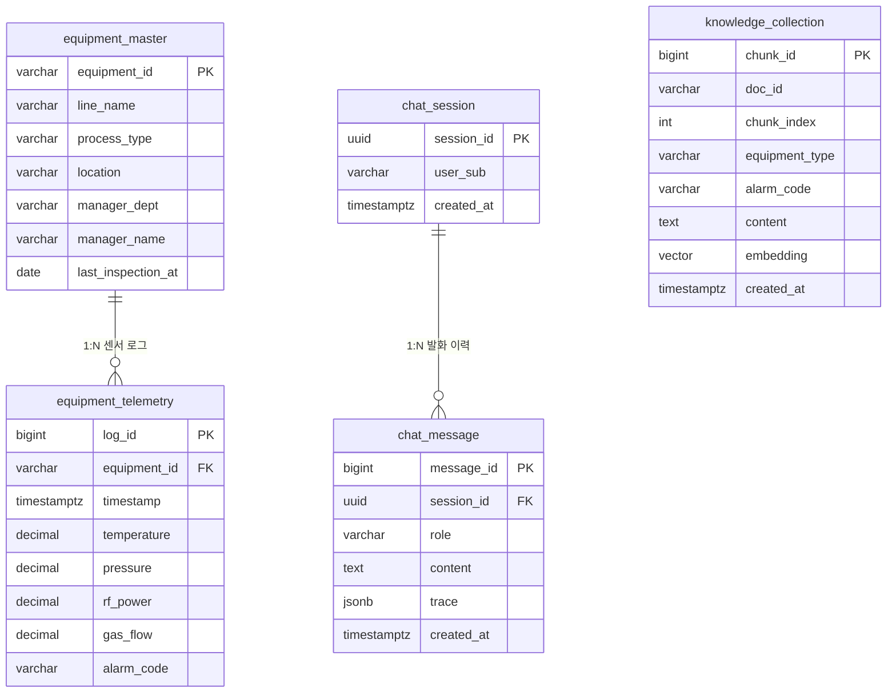

# 데이터베이스 설계 (DEV_DATABASE / DEV_VECTORDB)

이 문서는 백엔드가 사용하는 데이터베이스 구조를 설명합니다. PostgreSQL 16과 pgvector
확장을 사용하는 단일 인스턴스로, 정형 데이터(설비·센서), 매뉴얼 벡터 컬렉션, 대화 이력을
하나의 데이터베이스에서 관리합니다. 스키마는 요구사항 정의서 §8과 ERD v2를 기준으로 합니다.

관련 문서로는 [ADR-0001 아키텍처](adr/0001-architecture.md)와 요구사항 정의서 §8을 함께 참고하시기 바랍니다.

## 테이블 개요

각 테이블이 담당하는 역할은 다음과 같습니다.

| 테이블 | 담당 역할 | 관련 기능 ID |
| --- | --- | --- |
| `equipment_master` | 설비 고유 정보와 메타데이터 관리 | DEV_DATABASE, BE_MCP03_MASTER01 |
| `equipment_telemetry` | 설비 센서 수치와 알람 로그 적재 | DEV_DATABASE, BE_MCP02_TELEMETRY01/02 |
| `knowledge_collection` | 매뉴얼 청크와 임베딩 벡터 저장·검색 | DEV_VECTORDB, BE_MCP04_RAG01 |
| `chat_session` | 사용자 대화 세션 관리 | BE_CHAT01_QUERY01 |
| `chat_message` | 대화 메시지와 추론 기록 저장 | BE_CHAT01_QUERY01 |

## ERD

현재 스키마 기준 관계도입니다. `knowledge_collection`은 벡터 검색 전용 컬렉션이므로
다른 테이블과 외래 키 관계를 맺지 않습니다.



## 테이블 상세

### equipment_master (§8.1)

이 테이블은 설비의 고유 정보와 메타데이터를 담당합니다. 설비 ID를 기준으로 라인, 공정 단계,
설치 위치, 담당 부서, 책임자, 마지막 점검일을 관리하며, 설비 메타데이터 조회 도구(BE_MCP03_MASTER01)의 기준 데이터가 됩니다.
책임자와 마지막 점검일은 대시보드 상세 표기용 확장 컬럼(ERD v2)이며, 마지막 점검일은 점검 이후 센서 추세 변화를 질의할 때 분석 기준점으로도 활용됩니다.

| 컬럼 | 타입 | 제약 | 설명 |
| --- | --- | --- | --- |
| equipment_id | varchar(50) | PK | 설비 고유 ID (예: EQP-003) |
| line_name | varchar(50) | NN | 라인명 (예: B-Line) |
| process_type | varchar(50) | NN | 공정 단계 (예: Etching) |
| location | varchar(50) |  | 설치 위치 |
| manager_dept | varchar(50) |  | 담당 부서 |
| manager_name | varchar(50) |  | 책임자 이름 (ERD v2 신규) |
| last_inspection_at | date |  | 마지막 점검일 (ERD v2 신규) |

### equipment_telemetry (§8.2)

이 테이블은 설비에서 발생하는 센서 수치와 알람 로그를 담당합니다. 실시간 원격 측정 도구와
알람 이력 집계 도구(BE_MCP02_TELEMETRY01/02)가 이 테이블을 조회하며, 시뮬레이터가 데이터를 적재합니다.

| 컬럼 | 타입 | 제약 | 설명 |
| --- | --- | --- | --- |
| log_id | bigint | PK, identity | 로그 ID |
| equipment_id | varchar(50) | FK, NN | equipment_master 참조 |
| timestamp | timestamptz | NN, default now | 수집 시각 |
| temperature | decimal(5,2) |  | 온도 °C |
| pressure | decimal(5,2) |  | 압력 |
| rf_power | decimal(6,2) |  | RF 파워 kW (ERD v2 신규) |
| gas_flow | decimal(7,2) |  | 가스 유량 sccm (ERD v2 신규) |
| alarm_code | varchar(20) |  | 알람 코드 (예: ERR-402) |

`(equipment_id, timestamp)` 복합 인덱스(`ix_telemetry_equipment_time`)로 설비별 기간 조회에
대응합니다. rf_power와 gas_flow는 에칭 장비 특성을 반영한 확장 컬럼이며, §8.2 샘플에는 값이 없습니다.

### knowledge_collection (§8.3)

이 테이블은 매뉴얼 문서를 청크 단위로 나눈 본문과 임베딩 벡터의 저장·검색을 담당합니다.
지식베이스 검색 도구(BE_MCP04_RAG01)가 유사도 검색으로 이 컬렉션을 조회합니다.

| 컬럼 | 타입 | 제약 | 설명 |
| --- | --- | --- | --- |
| chunk_id | bigint | PK, identity | 청크 ID |
| doc_id | varchar(50) | NN | 원본 문서 ID (예: MAN-ETC-042) |
| chunk_index | int | NN | 문서 내 청크 순서 |
| equipment_type | varchar(50) |  | 메타 필터용 공정 유형 |
| alarm_code | varchar(20) |  | 메타 필터용 알람 코드 |
| content | text | NN | 청크 본문 |
| embedding | vector(1536) |  | 임베딩 벡터 |
| created_at | timestamptz | NN, default now | 적재 시각 |

임베딩 컬럼에는 HNSW 인덱스(`ix_knowledge_embedding_hnsw`, vector_cosine_ops)를 두어 코사인
유사도 검색에 대응하며, equipment_type과 alarm_code에는 메타 필터 검색용 인덱스를 둡니다.
이 컬렉션은 벡터 검색 전용이므로 다른 테이블과 외래 키를 맺지 않습니다. 임베딩 차원(현재 1536)은
임베딩 모델 선정에 따라 조정해야 하며, 값이 일치하지 않으면 적재에 실패합니다.

### chat_session

이 테이블은 사용자별 대화 세션을 담당합니다. 세션 단위로 대화 메시지를 묶으며, 사용자 식별은
Keycloak OIDC subject로 수행합니다.

| 컬럼 | 타입 | 제약 | 설명 |
| --- | --- | --- | --- |
| session_id | uuid | PK, default gen_random_uuid | 세션 ID |
| user_sub | varchar(255) | NN | Keycloak OIDC subject |
| created_at | timestamptz | NN, default now | 생성 시각 |

user_sub는 IdP의 subject를 저장합니다. 로컬 사용자 테이블은 별도 담당 범위이므로 외래 키를 두지 않습니다.

### chat_message

이 테이블은 세션에 속한 개별 메시지와 추론 기록을 담당합니다. 사용자·에이전트 발화를 순서대로
저장하며, ReAct 추론 단계를 함께 보관합니다.

| 컬럼 | 타입 | 제약 | 설명 |
| --- | --- | --- | --- |
| message_id | bigint | PK, identity | 메시지 ID |
| session_id | uuid | FK, NN | chat_session 참조 |
| role | varchar(20) | NN, CHECK | user/assistant/system/tool |
| content | text | NN | 메시지 본문 |
| trace | jsonb |  | 추론 기록 (reasoning_steps·tool_calls) |
| created_at | timestamptz | NN, default now | 생성 시각 |

`(session_id, created_at)` 복합 인덱스(`ix_chat_message_session_time`)로 세션 이력을 순서대로
조회합니다. role에는 CHECK 제약(`ck_chat_message_role`)을 두어 허용된 값 외에는 거부하며,
trace에는 ReAct 단계(Thought·Action·Observation)를 jsonb로 적재합니다.

## 로컬 실행

다음 순서로 로컬 데이터베이스를 구성할 수 있습니다.

```bash
docker compose up -d db          # PostgreSQL + pgvector 기동
uv run alembic upgrade head      # 스키마 생성 (pgvector 확장 포함)
uv run python scripts/seed_data.py   # §8 샘플 데이터 적재 (멱등)
```

## 마이그레이션 규약

스키마 변경 시 다음 규약을 따릅니다.

- 모든 스키마 변경은 Alembic 마이그레이션으로 관리하며, 수동 DDL은 사용하지 않습니다.
- 신규 모델을 작성하면 `alembic/env.py`의 import 블록에 등록한 뒤 마이그레이션을 생성합니다.
- pgvector 확장, HNSW 인덱스, CHECK 제약은 autogenerate가 감지하지 못하므로 수동으로 보완합니다.
- 초기 스키마는 `alembic/versions/20260703_0001_initial_schema.py`에 정의되어 있습니다.
- `equipment_master`의 `manager_name`·`last_inspection_at` 컬럼은 `20260706_0002_equipment_meta.py`에서 추가되었습니다.
