# 데이터베이스 설계 (DEV_DATABASE / DEV_VECTORDB)

이 문서는 백엔드가 사용하는 데이터베이스 구조를 설명합니다. PostgreSQL 16과 pgvector
확장을 사용하는 단일 인스턴스로, 정형 데이터(설비·센서), 매뉴얼 벡터 컬렉션, 대화 이력을
하나의 데이터베이스에서 관리합니다. 스키마는 요구사항 정의서 §8과 ERD v2를 기준으로 합니다.

관련 문서로는 [ADR-0001 아키텍처](adr/0001-architecture.md)와 요구사항 정의서 §8을 함께 참고하시기 바랍니다.

## 테이블 개요

각 테이블이 담당하는 역할은 다음과 같습니다.

| 테이블 | 담당 역할 | 관련 기능 ID |
| --- | --- | --- |
| `users` | 로컬 사용자 계정(역할·상태) 관리 | BE_AUTH01_OAUTH01 |
| `sso_accounts` | 외부 IdP 계정과 로컬 사용자 연결 | BE_AUTH01_OAUTH01 |
| `audit_logs` | 요청 단위 감사 로그 적재 | INFRA_AOP01 |
| `lines` | 담당 라인 마스터 | BE_ADMIN01_LINE01 |
| `user_lines` | 사용자와 담당 라인의 M2M 연결 | BE_ADMIN01_LINE01 |
| `equipment_masters` | 설비 고유 정보와 메타데이터 관리 | DEV_DATABASE, BE_MCP03_MASTER01 |
| `equipment_telemetries` | 설비 센서 수치와 알람 로그 적재 | DEV_DATABASE, BE_MCP02_TELEMETRY01/02 |
| `equipment_alarms` | 센서 변수별 알람 이벤트(발생~해제) 저널 | NEW_ALARM01_HISTORY02 |
| `equipment_repairs` | 설비 수리 이력(책임자·시각·직전 알람) 적재 | NEW_REPAIR01_HISTORY01 |
| `knowledge_collection` | 매뉴얼 청크와 임베딩 벡터 저장·검색 | DEV_VECTORDB, BE_MCP04_RAG01 |
| `chat_session` | 사용자 대화 세션 관리 | BE_CHAT01_QUERY01 |
| `chat_message` | 대화 메시지와 추론 기록 저장 | BE_CHAT01_QUERY01 |
| `work_logs` | 현장 점검·조치 작업 로그(계획~완료) 관리 | NEW_LOOP01_WORKLOG01 |
| `notifications` | 상단 벨 알림 피드(설비+변수+알람 30분 버킷당 1건) | NEW_PROACT01_ALERT01/03 |
| `notification_reads` | 알림 읽음 상태를 사용자별로 보관 | BE_NOTI01_SCOPE01 |
| `equipment_anomaly_models` | 공정 유형별 이상 감지 모델 파라미터 보관 | BE_ANOM01_SERVE01 |
| `equipment_anomaly_calibrations` | 설비별 EWMA 한계 캘리브레이션 값 | BE_ANOM01_CALIB01 |
| `equipment_anomaly_shadow_events` | 섀도우 모드 이상 감지 관찰 저널 | BE_ANOM01_SHADOW01 |

## ERD

현재 스키마 기준 관계도입니다. `knowledge_collection`은 벡터 검색 전용 컬렉션이므로
다른 테이블과 외래 키 관계를 맺지 않습니다.

```mermaid
erDiagram
    equipment_masters ||--o{ equipment_telemetries : "1:N 센서 로그"
    chat_session ||--o{ chat_message : "1:N 발화 이력"
    equipment_masters ||--o| equipment_anomaly_calibrations : "1:1 설비별 한계"
    equipment_masters ||--o{ equipment_anomaly_shadow_events : "1:N 섀도우 관찰"
    equipment_masters ||--o{ equipment_repairs : "1:N 수리 이력"
    equipment_masters ||--o{ work_logs : "1:N 작업 로그"
    notifications ||--o{ notification_reads : "1:N 사용자별 읽음"
    notifications ||--o{ work_logs : "1:N 알림 기인 작업"
    users ||--o{ notification_reads : "1:N 읽은 알림"
    users ||--o{ sso_accounts : "1:N IdP 계정"
    users ||--o{ audit_logs : "1:N 감사 기록"
    users ||--o{ user_lines : "1:N 담당 배정"
    users ||--o{ equipment_repairs : "1:N 수리 책임"
    lines ||--o{ user_lines : "1:N 담당 배정"

    equipment_masters {
        varchar equipment_id PK
        varchar line_name
        varchar process_type
        varchar location
        varchar manager_dept
        varchar manager_name
        date last_inspection_at
    }
    equipment_telemetries {
        bigint log_id PK
        varchar equipment_id FK
        timestamptz timestamp
        decimal temperature
        decimal pressure
        decimal rf_power
        decimal gas_flow
        varchar alarm_code
    }
    knowledge_collection {
        bigint chunk_id PK
        varchar doc_id
        int chunk_index
        varchar equipment_type
        varchar alarm_code
        text content
        vector embedding
        timestamptz created_at
    }
    chat_session {
        uuid session_id PK
        varchar user_sub
        timestamptz created_at
    }
    chat_message {
        bigint message_id PK
        uuid session_id FK
        varchar role
        text content
        jsonb trace
        timestamptz created_at
    }
    notifications {
        bigint id PK
        timestamptz occurred_at
        varchar equipment_id
        varchar line_name
        varchar metric
        varchar alarm_code
        text message
        timestamptz bucket_start
        bigint source_alarm_id
        timestamptz created_at
    }
    notification_reads {
        bigint id PK
        bigint notification_id FK
        bigint user_id FK
        timestamptz read_at
    }
    equipment_anomaly_models {
        varchar process_type PK
        int window
        int stride
        int confirm_k
        float ewma_limit
        jsonb state
        int train_rows
        timestamptz fitted_at
    }
    equipment_anomaly_calibrations {
        varchar equipment_id PK
        float ewma_limit
        int train_windows
        timestamptz calibrated_at
    }
    equipment_anomaly_shadow_events {
        bigint event_id PK
        varchar equipment_id FK
        varchar metric
        float score
        timestamptz raised_at
        timestamptz cleared_at
    }
    users {
        bigint id PK
        varchar email UK
        varchar name
        varchar role
        varchar status
        timestamptz last_login_at
        timestamptz created_at
        timestamptz updated_at
    }
    sso_accounts {
        bigint id PK
        bigint user_id FK
        varchar provider
        varchar provider_user_id
        varchar tenant_id
        varchar provider_email
        timestamptz created_at
        timestamptz updated_at
    }
    audit_logs {
        bigint id PK
        bigint user_id FK
        varchar action
        varchar method
        varchar path
        int status_code
        varchar ip_address
        text user_agent
        boolean success
        text error_message
        timestamptz created_at
    }
    lines {
        bigint id PK
        varchar code UK
        varchar name
        text description
        int display_order
        varchar status
        timestamptz created_at
        timestamptz updated_at
    }
    user_lines {
        bigint id PK
        bigint user_id FK
        bigint line_id FK
        timestamptz created_at
    }
    equipment_repairs {
        bigint id PK
        varchar equipment_id FK
        bigint repaired_by FK
        timestamptz repaired_at
        varchar alarm_code_before
        text note
        timestamptz created_at
    }
    work_logs {
        bigint id PK
        varchar owner_sub
        varchar work_type
        varchar worker_name
        bigint source_notification_id FK
        varchar equipment_id FK
        varchar alarm_code
        timestamptz started_at
        timestamptz ended_at
        text plan
        text completion
        timestamptz completed_at
        varchar status
        timestamptz deleted_at
        timestamptz created_at
    }
```



## 테이블 상세

### users (BE_AUTH01_OAUTH01)

이 테이블은 로컬 사용자 계정을 담당합니다. 인증 자체는 Azure AD가 수행하지만
([ADR-0002](adr/0002-auth-session.md)), 역할·상태·담당 라인 같은 서비스 고유 속성은 IdP가
보유하지 않으므로 로컬에 별도로 둡니다.

| 컬럼 | 타입 | 제약 | 설명 |
| --- | --- | --- | --- |
| id | bigint | PK, identity always | 사용자 ID |
| email | varchar(255) | NN, UNIQUE | 이메일, 세션 소유자 식별자와 동일 |
| name | varchar(100) | NN | 표시명 |
| role | varchar(20) | NN, CHECK | admin / field_engineer |
| status | varchar(20) | NN, default active | active / inactive / suspended |
| last_login_at | timestamptz |  | 마지막 로그인 시각 |
| created_at | timestamptz | NN, default now | 생성 시각 |
| updated_at | timestamptz | NN, default now | 수정 시각 |

role과 status는 CHECK 제약(`ck_users_role`·`ck_users_status`)으로 허용값을 강제합니다. 권한
분기가 문자열 비교에 의존하므로 오타가 조용히 통과하면 인가 판정이 무력화될 수 있어, 애플리케이션
검증에만 맡기지 않고 DB 레벨에서 막습니다.

### sso_accounts (BE_AUTH01_OAUTH01)

이 테이블은 외부 IdP 계정과 로컬 사용자를 연결합니다. 사용자와 1:N으로 두어 이후 다른 IdP를
추가하더라도 계정 통합이 가능하도록 했습니다.

| 컬럼 | 타입 | 제약 | 설명 |
| --- | --- | --- | --- |
| id | bigint | PK, identity always | 연결 ID |
| user_id | bigint | FK, NN, ON DELETE CASCADE | users 참조 |
| provider | varchar(50) | NN | IdP 식별자 (예: azure-ad) |
| provider_user_id | varchar(255) | NN | IdP가 발급한 사용자 ID |
| tenant_id | varchar(255) |  | 테넌트 ID |
| provider_email | varchar(255) |  | IdP가 보고한 이메일 |
| created_at | timestamptz | NN, default now | 생성 시각 |
| updated_at | timestamptz | NN, default now | 수정 시각 |

`(provider, provider_user_id)` 유니크 제약(`uq_sso_provider_identity`)으로 동일 IdP 계정이 여러
로컬 사용자에 붙는 것을 막습니다. 로그인 식별은 이메일이 아니라 이 쌍을 기준으로 하는데, IdP에서
이메일이 변경될 수 있는 반면 subject는 불변이기 때문입니다.

### audit_logs (INFRA_AOP01)

이 테이블은 요청 단위 감사 기록을 담당합니다. 적재는 데코레이터로 수행하며, 배경은
[ADR-0008](adr/0008-cross-cutting-aop-i18n.md)에 있습니다.

| 컬럼 | 타입 | 제약 | 설명 |
| --- | --- | --- | --- |
| id | bigint | PK, identity always | 감사 로그 ID |
| user_id | bigint | FK, ON DELETE SET NULL | users 참조, 미인증 요청은 NULL |
| action | varchar(100) | NN | 감사 대상 행위명 |
| method | varchar(10) |  | HTTP 메서드 |
| path | varchar(500) |  | 요청 경로 |
| status_code | int |  | 응답 상태 코드 |
| ip_address | varchar(45) |  | 요청 IP (IPv6 길이 기준) |
| user_agent | text |  | User-Agent 헤더 |
| success | boolean | NN | 성공 여부 |
| error_message | text |  | 실패 사유 |
| created_at | timestamptz | NN, default now | 기록 시각 |

사용자 삭제 시 `SET NULL`로 참조만 해제하고 기록 자체는 남깁니다. 감사 로그는 행위자가
사라지더라도 보존되어야 하기 때문입니다. 조회 축이 사용자별·행위별·상태별·성패별로 나뉘고 모두
시간 정렬을 동반하므로, 각 축과 `created_at`을 묶은 복합 인덱스 네 개를 둡니다.

### lines (BE_ADMIN01_LINE01)

이 테이블은 담당 라인 마스터를 담당하며, 관리자 CRUD 대상입니다.

| 컬럼 | 타입 | 제약 | 설명 |
| --- | --- | --- | --- |
| id | bigint | PK, identity always | 라인 ID |
| code | varchar(50) | NN, UNIQUE | 설비 line_name과 매칭되는 코드 |
| name | varchar(100) | NN | 표시명 |
| description | text |  | 설명 |
| display_order | int |  | 목록 정렬 순서 |
| status | varchar(20) | NN, default active | active / inactive |
| created_at | timestamptz | NN, default now | 생성 시각 |
| updated_at | timestamptz | NN, default now | 수정 시각 |

`code`가 `equipment_masters.line_name`과 이어지는 연결 고리입니다. 설비 마스터가 라인을 문자열로
보유하는 기존 스키마(§8.1)를 유지한 채 담당 라인 관리를 얹어야 했으므로, 설비 쪽에 외래 키를
추가하는 대신 코드 일치로 연결합니다.

### user_lines (BE_ADMIN01_LINE01)

이 테이블은 사용자와 담당 라인의 M2M 관계를 담당합니다. 한 사용자가 여러 라인을, 한 라인이 여러
사용자를 가질 수 있습니다.

| 컬럼 | 타입 | 제약 | 설명 |
| --- | --- | --- | --- |
| id | bigint | PK, identity always | 배정 ID |
| user_id | bigint | FK, NN, ON DELETE CASCADE | users 참조 |
| line_id | bigint | FK, NN, ON DELETE CASCADE | lines 참조 |
| created_at | timestamptz | NN, default now | 배정 시각 |

`(user_id, line_id)` 유니크 제약으로 중복 배정을 막고, 양방향 조회를 위해 각 외래 키에 인덱스를
둡니다. 이 테이블이 알림 스코핑의 기준이 되며([ADR-0004](adr/0004-realtime-sse.md) 결정 3-1),
배정이 없는 사용자는 알림을 받지 않습니다.

### equipment_masters (§8.1)

이 테이블은 설비의 고유 정보와 메타데이터를 담당합니다. 설비 ID를 기준으로 라인, 공정 단계,
설치 위치, 담당 부서, 책임자, 마지막 점검일을 관리하며, 설비 메타데이터 조회 도구(BE_MCP03_MASTER01)의 기준 데이터가 됩니다.
책임자와 마지막 점검일은 대시보드 상세 표기용 확장 컬럼(ERD v2)이며, 마지막 점검일은 점검 이후 센서 추세 변화를 질의할 때 분석 기준점으로도 활용됩니다.

| 컬럼 | 타입 | 제약 | 설명 |
| --- | --- | --- | --- |
| equipment_id | varchar(50) | PK | 설비 고유 ID (예: EQP-003) |
| line_name | varchar(50) | NN | 라인명 (예: B라인) |
| process_type | varchar(50) | NN | 공정 단계 (예: Etching) |
| location | varchar(50) |  | 설치 위치 |
| manager_dept | varchar(50) |  | 담당 부서 |
| manager_name | varchar(50) |  | 책임자 이름 (ERD v2 신규) |
| last_inspection_at | date |  | 마지막 점검일 (ERD v2 신규) |

### equipment_telemetries (§8.2)

이 테이블은 설비에서 발생하는 센서 수치와 알람 로그를 담당합니다. 실시간 원격 측정 도구와
알람 이력 집계 도구(BE_MCP02_TELEMETRY01/02)가 이 테이블을 조회하며, 시뮬레이터가 데이터를 적재합니다.

| 컬럼 | 타입 | 제약 | 설명 |
| --- | --- | --- | --- |
| log_id | bigint | PK, identity | 로그 ID |
| equipment_id | varchar(50) | FK, NN | equipment_masters 참조 |
| timestamp | timestamptz | NN, default now | 수집 시각 |
| temperature | decimal(5,2) |  | 온도 °C |
| pressure | decimal(5,2) |  | 압력 mTorr |
| rf_power | decimal(6,2) |  | RF 파워 kW (ERD v2 신규) |
| gas_flow | decimal(7,2) |  | 가스 유량 sccm (ERD v2 신규) |
| alarm_code | varchar(20) |  | 대표 알람 코드, 활성 변수별 알람 중 최고 심각도 파생값 |

`(equipment_id, timestamp)` 복합 인덱스(`ix_telemetry_equipment_time`)로 설비별 기간 조회에
대응합니다. 장비별 알람 이력 조회(NEW_ALARM01_HISTORY01/02)는 알람이 희소한 특성을 살려
`(equipment_id, timestamp) WHERE alarm_code IS NOT NULL` 부분 인덱스(`ix_telemetry_equip_alarm_time`)로
대응합니다. 설계 결정 배경은 docs/adr/0006-alarm-history-query.md, 인덱스 조합별 성능 비교는
docs/bench/alarm-query-index.md에 정리되어 있습니다.
rf_power와 gas_flow는 에칭 장비 특성을 반영한 확장 컬럼입니다. 압력은 시뮬레이터
구현 참고서 §2 기준으로 mTorr 단위를 사용합니다. 알람 코드는 급성 이상 `ERR-\d{3}`과
드리프트/PM·SPC 확장 `WRN-\d{3}`을 함께 사용하며, 에이전트는 두 접두어를 모두 인식합니다.
`alarm_code`는 센서 변수별 알람 저널(`equipment_alarms`)의 활성 알람 중 최고 심각도를 파생한
대표값으로, 실시간 상태·알림·SSE가 그대로 소비합니다. 변수별 상세 발생 이력은 저널을 참조합니다.

### equipment_alarms (§8.2a)

이 테이블은 센서 변수별 알람을 값 시계열과 분리해 이벤트로 기록하는 알람 저널입니다(NEW_ALARM01_HISTORY02).
한 설비가 온도 급성(ERR-401)과 압력 드리프트(WRN-702)를 동시에 갖는 것처럼, 각 센서 변수는
독립적으로 발생~해제 생명주기를 가집니다. 도넛 차트의 센서별 발생 횟수는 이 테이블을 `metric` 기준으로
집계해 산출합니다.

| 컬럼 | 타입 | 제약 | 설명 |
| --- | --- | --- | --- |
| alarm_id | bigint | PK, identity | 알람 이벤트 ID |
| equipment_id | varchar(50) | FK, NN | equipment_masters 참조 |
| metric | varchar(20) | NN | 센서 변수 키 (temperature/pressure/rf_power/gas_flow) |
| alarm_code | varchar(20) | NN | 단일변수 알람 코드 (예: ERR-401) |
| severity | varchar(10) | NN | 심각도 (주의/위험) |
| raised_at | timestamptz | NN, default now | 발생 시각 |
| cleared_at | timestamptz |  | 해제 시각, NULL이면 활성 |

`(equipment_id, metric, raised_at)` 인덱스(`ix_equipment_alarms_equip_metric_time`)로 센서별 이력·집계에
대응하고, 활성 알람 조회·발생/해제 전이 판정은 `cleared_at IS NULL` 부분 인덱스(`ix_equipment_alarms_active`)로
대응합니다. 시뮬레이터가 변수별 확정 알람의 상태전이(발생·해제)를 이 테이블에 적재하며, 복합 코드
(과거 ERR-402·ERR-901)는 변수 간 코드 전이를 유발하므로 사용하지 않고 항상 단일변수 코드로 발생시킵니다.

### knowledge_collection (§8.3)

이 테이블은 매뉴얼 문서를 청크 단위로 나눈 본문과 임베딩 벡터의 저장·검색을 담당합니다.
지식베이스 검색 도구(BE_MCP04_RAG01)가 유사도 검색으로 이 컬렉션을 조회합니다.

| 컬럼 | 타입 | 제약 | 설명 |
| --- | --- | --- | --- |
| chunk_id | bigint | PK, identity | 청크 ID |
| doc_id | varchar(50) | NN | 원본 문서 ID (예: MAN-ETC-042) |
| chunk_index | int | NN | 문서 내 청크 순서 |
| equipment_type | varchar(50) |  | 메타 필터용 공정 유형 |
| alarm_code | varchar(20) |  | 메타 필터용 알람 코드 |
| content | text | NN | 청크 본문 |
| embedding | vector(1536) | NN | 임베딩 벡터 |
| created_at | timestamptz | NN, default now | 적재 시각 |

임베딩 컬럼에는 HNSW 인덱스(`ix_knowledge_embedding_hnsw`, vector_cosine_ops)를 두어 코사인
유사도 검색에 대응하며, equipment_type과 alarm_code에는 메타 필터 검색용 인덱스를 둡니다.
이 컬렉션은 벡터 검색 전용이므로 다른 테이블과 외래 키를 맺지 않습니다. 임베딩 차원(현재 1536)은
임베딩 모델 선정에 따라 조정해야 하며, 값이 일치하지 않으면 적재에 실패합니다.

### chat_session

이 테이블은 사용자별 대화 세션을 담당합니다. 세션 단위로 대화 메시지를 묶습니다.

| 컬럼 | 타입 | 제약 | 설명 |
| --- | --- | --- | --- |
| session_id | uuid | PK, default gen_random_uuid | 세션 ID |
| user_sub | varchar(255) | NN | 세션 소유자 식별자 (실제 저장 값은 email) |
| created_at | timestamptz | NN, default now | 생성 시각 |

초기 설계는 Keycloak을 IdP로 가정해 컬럼명을 `user_sub`로 정하고 OIDC subject를 저장할
예정이었습니다. 이후 인증이 Azure AD SSO + opaque 세션 쿠키로 정착하면서
([ADR-0002](adr/0002-auth-session.md)), 세션에 JWT 클레임 전체를 넣지 않기로 해 `sub` 키가
사라졌고 소유자 식별자를 `email`로 통일했습니다. 따라서 컬럼명은 `user_sub`이지만 실제 저장
값은 email이며, 이는 ADR-0002에 명명 부채로 기록되어 있습니다. `work_logs.owner_sub`도 같은
사정입니다. 사용자 정보는 `users` 테이블이 별도로 보유하지만 세션 이력의 보존을 위해 외래 키는
두지 않습니다.

### chat_message

이 테이블은 세션에 속한 개별 메시지와 추론 기록을 담당합니다. 사용자·에이전트 발화를 순서대로
저장하며, ReAct 추론 단계를 함께 보관합니다.

| 컬럼 | 타입 | 제약 | 설명 |
| --- | --- | --- | --- |
| message_id | bigint | PK, identity | 메시지 ID |
| session_id | uuid | FK, NN | chat_session 참조 |
| role | varchar(20) | NN, CHECK | user/assistant/system/tool |
| content | text | NN | 메시지 본문 |
| trace | jsonb |  | 추론 기록 (reasoning_steps·tool_calls) |
| created_at | timestamptz | NN, default now | 생성 시각 |

`(session_id, created_at)` 복합 인덱스(`ix_chat_message_session_time`)로 세션 이력을 순서대로
조회합니다. role에는 CHECK 제약(`ck_chat_message_role`)을 두어 허용된 값 외에는 거부하며,
trace에는 ReAct 단계(Thought·Action·Observation)를 jsonb로 적재합니다.

### notifications (NEW_PROACT01_ALERT01)

이 테이블은 상단 벨에 노출되는 전역 알림 피드를 담당합니다. `equipment_alarms` 저널을
백그라운드 워처가 주기적으로 읽어 멱등 적재하며, 설비 단위 이력 조회는
[ADR-0006](adr/0006-alarm-history-query.md)의 별도 경로를 사용합니다.

| 컬럼 | 타입 | 제약 | 설명 |
| --- | --- | --- | --- |
| id | bigint | PK, identity | 알림 ID |
| occurred_at | timestamptz | NN | 알람 발생 시각 |
| equipment_id | varchar(50) | NN | 설비 ID |
| line_name | varchar(50) |  | 발생 설비의 소속 라인, 담당 라인 스코핑 기준 |
| metric | varchar(20) |  | 알람 발생 센서 변수, 특정 불가 시 NULL |
| alarm_code | varchar(20) | NN | 알람 코드 |
| message | text | NN | 알림 문구 |
| bucket_start | timestamptz | NN | 발생 시각의 30분 절단값 |
| source_alarm_id | bigint |  | 버킷 첫 equipment_alarms 참조, 워처 선제 알림은 NULL |
| created_at | timestamptz | NN, default now | 적재 시각 |

`(equipment_id, metric, alarm_code, bucket_start)` 유니크 제약으로 동일 설비의 같은 변수·알람은
30분 버킷당 1건만 적재해 반복 알람의 중복을 억제하며, 이 제약이 워처 재실행 시의 멱등성도
보장합니다. 조회 인덱스는 이력 정렬용 `ix_notifications_occurred_at`과 담당 라인 스코핑용
`(line_name, occurred_at)` 복합 인덱스 두 가지입니다. `line_name`은 매 조회마다
`equipment_masters`·`lines`·`user_lines`를 3중 조인하지 않도록 적재 시점에 비정규화 보관하는
값이며, 배경은 [ADR-0004](adr/0004-realtime-sse.md) 결정 3-1에 있습니다.

### notification_reads (BE_NOTI01_SCOPE01)

이 테이블은 알림의 읽음 상태를 사용자별로 담당합니다. 읽음 여부를 `notifications.is_read`
단일 플래그로 보관하던 구조에서는 한 사용자가 읽으면 모든 사용자에게 읽음으로 보였기 때문에
(알림, 사용자) 연결 테이블로 분리했습니다.

| 컬럼 | 타입 | 제약 | 설명 |
| --- | --- | --- | --- |
| id | bigint | PK, identity always | 읽음 기록 ID |
| notification_id | bigint | FK, NN, ON DELETE CASCADE | notifications 참조 |
| user_id | bigint | FK, NN, ON DELETE CASCADE | users 참조 |
| read_at | timestamptz | NN, default now | 읽은 시각 |

행의 존재 여부로 읽음을 판정하며, 읽음 해제는 행 삭제입니다. `(notification_id, user_id)`
유니크 제약으로 중복 기록을 막고, 미읽음 판정(`NOT EXISTS`) 조회를 위해
`(user_id, notification_id)` 인덱스를 둡니다. 마이그레이션 0028에서 기존 `is_read=true` 행은
현재 화면 상태를 유지하기 위해 전체 사용자 기준으로 이관한 뒤 컬럼을 제거했습니다.

### equipment_anomaly_models (BE_ANOM01_SERVE01)

이 테이블은 공정 유형별로 적합된 이상 감지 모델 파라미터를 담당합니다. 스코어러가 기동 시
적재하며, 주기 재적합(BE_ANOM01_DRIFT01)이 갱신 대상으로 삼습니다.

| 컬럼 | 타입 | 제약 | 설명 |
| --- | --- | --- | --- |
| process_type | varchar(50) | PK | 공정 유형 (모델 공유 단위) |
| window | int | NN | 윈도우 길이 (tick) |
| stride | int | NN | 슬라이드 간격 (tick) |
| confirm_k | int | NN | 지속 확인 윈도우 수 |
| ewma_limit | float |  | 공정 유형 EWMA 한계 |
| state | jsonb | NN | PCA MSPC 파라미터 직렬화 |
| train_rows | int | NN | 적합 표본 수 |
| fitted_at | timestamptz | NN, default now | 적합 시각 |

파라미터를 pickle이 아니라 JSONB 배열로 직렬화해 보관합니다. pickle은 라이브러리 버전이
바뀌면 역직렬화가 깨지는 취약성이 있기 때문입니다. 설비 개체가
아니라 공정 유형을 키로 삼는 이유는 설비별 표본이 적합에 충분하지 않기 때문이며, 개체 편차는
아래 캘리브레이션 테이블이 흡수합니다.

### equipment_anomaly_calibrations (BE_ANOM01_CALIB01)

이 테이블은 공유 공정 유형 모델에 대해 설비 개체의 정상 분포로 산출한 EWMA 한계를 담당합니다.

| 컬럼 | 타입 | 제약 | 설명 |
| --- | --- | --- | --- |
| equipment_id | varchar(50) | PK, FK | equipment_masters 참조 |
| ewma_limit | float | NN | 설비별 EWMA 한계 |
| train_windows | int | NN | 캘리브레이션 표본 수 |
| calibrated_at | timestamptz | NN, default now | 산출 시각 |

같은 공정 유형이라도 설비마다 정상 운전점의 오프셋이 달라 공유 한계만으로는 특정 설비가
과민하거나 과둔감해집니다. 캘리브레이션 값이 없는 설비는 스코어러가 공정 유형 한계로
폴백하며, 과민·과둔감을 막기 위해 산출값은 공정 유형 한계 대비
`anomaly_calibration_min_ratio`(0.5) ~ `anomaly_calibration_max_ratio`(1.5) 범위로 제한합니다.

### equipment_anomaly_shadow_events (BE_ANOM01_SHADOW01)

이 테이블은 섀도우 모드에서 스코어러 판정을 관찰 기록하는 저널을 담당합니다. 알림 파이프라인에
연결하지 않고 기록만 남겨, 규칙 레이어 알람과 조인해 감지 격차를 정량 리뷰하는 용도입니다.

| 컬럼 | 타입 | 제약 | 설명 |
| --- | --- | --- | --- |
| event_id | bigint | PK, identity | 관찰 이벤트 ID |
| equipment_id | varchar(50) | FK, NN | equipment_masters 참조 |
| metric | varchar(20) | NN | 최대 기여 센서 변수 |
| score | float | NN | 발생 시 정규화 점수 |
| raised_at | timestamptz | NN, default now | 발생 시각 |
| cleared_at | timestamptz |  | 해제 시각, NULL이면 활성 |

`equipment_alarms`와 동일한 발생~해제 구조를 따라 두 레이어를 같은 기준으로 비교할 수 있게
했습니다. 활성 관찰 조회가 발생·해제 전이 판정마다 필요하므로
`cleared_at IS NULL` 부분 인덱스(`ix_anomaly_shadow_active`)를 둡니다.

## 로컬 실행

다음 순서로 로컬 데이터베이스를 구성할 수 있습니다.

```bash
docker compose up -d db          # PostgreSQL + pgvector 기동
uv run alembic upgrade head      # 스키마 생성 (pgvector 확장 포함)
uv run python scripts/seed_data.py   # §8 샘플 데이터 적재 (멱등)
```

## 마이그레이션 규약

스키마 변경 시 다음 규약을 따릅니다.

- 모든 스키마 변경은 Alembic 마이그레이션으로 관리하며, 수동 DDL은 사용하지 않습니다.
- 신규 모델을 작성하면 `alembic/env.py`의 import 블록에 등록한 뒤 마이그레이션을 생성합니다.
- pgvector 확장, HNSW 인덱스, CHECK 제약은 autogenerate가 감지하지 못하므로 수동으로 보완합니다.
- 초기 스키마는 `alembic/versions/20260703_0001_initial_schema.py`에 정의되어 있습니다.
- `equipment_masters`의 `manager_name`·`last_inspection_at` 컬럼은 `20260706_0002_equipment_meta.py`에서 추가되었습니다.
- telemetry 도메인 테이블명 복수화(`equipment_masters`·`equipment_telemetries`)는 `20260706_0003_pluralize_telemetry.py`에서 적용되었습니다.
