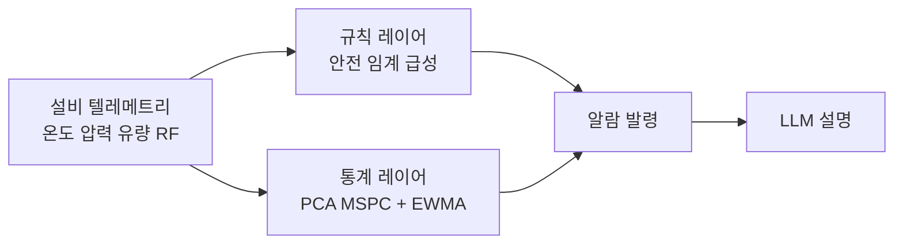
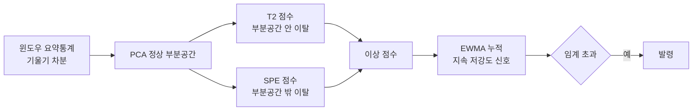
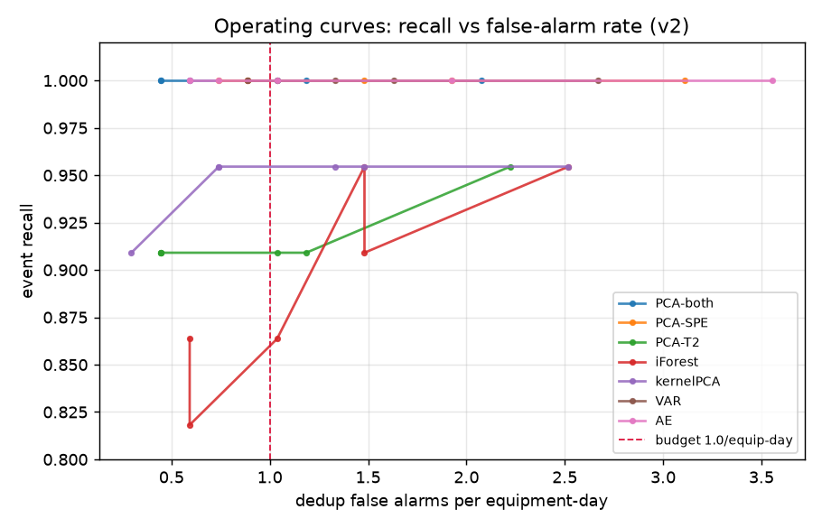
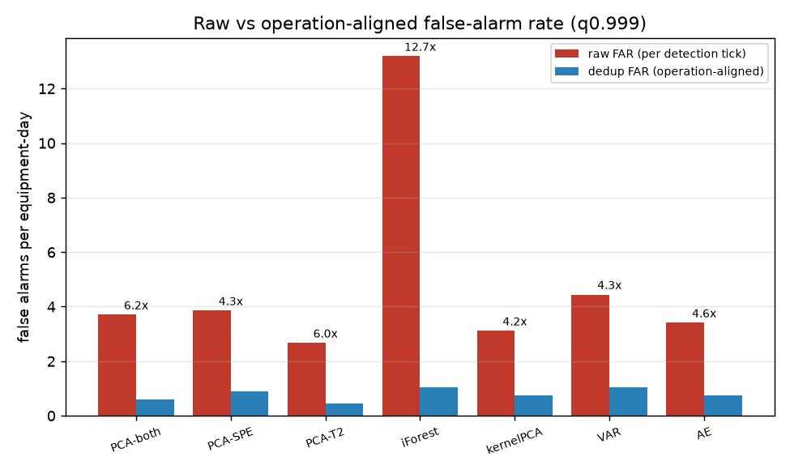
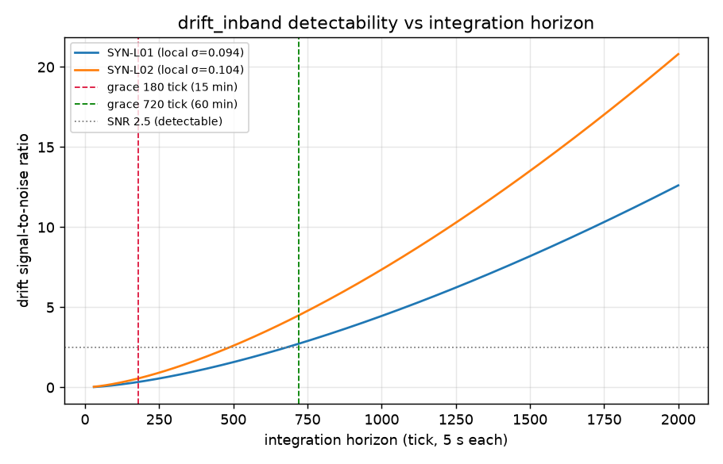

# 이상 감지 모델 요약: 무엇을 왜 골랐고 어떻게 평가했는가

이 문서는 이상 감지에 어떤 모델을 최종 선택했는지, 왜 그 모델이 다른 비교군보다 나은지, 어떤 지표로 어떻게 평가했는지를 개념 설명과 실측 수치, 그림으로 정리합니다. 배경 결정은 [ADR-0010](../adr/0010-anomaly-detection.md), 평가 측정 정합은 [ADR-0011](../adr/0011-anomaly-eval-metrics.md)에 있으며, 본 문서는 둘을 한눈에 이해할 수 있게 엮은 요약본입니다.

## 1. 한눈에 보는 결론

- 최종 선택 모델은 **PCA MSPC(T²+SPE) + EWMA 누적**이며, 코드상 이름은 `PCA-both`입니다.
- 평가 세트 v2 기준 실측 성능은 **event recall 1.000, 운영 정합 오탐(dedup FAR) 0.59건/설비·일**입니다.
- 딥러닝(오토인코더)·거리 기반(TS2Vec, Isolation Forest) 등 어떤 비교군도 **공정한 운영점에서 이 모델을 유의미하게 넘지 못했습니다**. 오토인코더는 동률에 그치고 오탐은 오히려 열위였습니다.
- 즉 자기지도 딥 모델 도입의 실익은 현재 없으며, 실제 성과는 새 모델이 아니라 **측정을 운영과 정합시킨 것**에서 나왔습니다.

## 2. 개념부터: 이 모델이 푸는 문제

### 2.1 무엇을 감지하나

식각 설비는 온도, 압력, 유량, RF 전력 같은 센서 값을 주기적으로 내보냅니다. 이상 감지는 이 다변량 신호에서 **정상 운전의 모양을 학습한 뒤, 거기서 벗어나는 순간을 잡는** 문제입니다. 핵심 난점은 두 가지입니다. 첫째, 각 센서가 모두 정상 범위 안에 있으면서 **센서 사이의 관계만 깨지는** 복합 이상이 있습니다. 둘째, 설비마다 정상 운전점이 달라 고정 임계로는 개체 차를 반영할 수 없습니다.

### 2.2 레이어드 구조: 규칙 위에 통계를 얹습니다

규칙 임계를 제거하지 않고, 그 위에 통계 레이어를 더합니다. 규칙은 과온·과압 같은 안전 한계를 결정론적으로 즉시 잡고, 통계 레이어는 규칙이 못 잡는 관계 이상을 잡습니다. 두 레이어의 사각이 서로 반대라 상호 보완합니다.

### 2.3 PCA MSPC란: 정상을 재구성하고 잔차로 점수를 매깁니다

PCA MSPC는 다변량 통계 공정 관리 기법입니다. 정상 데이터만으로 PCA를 학습해 변수들이 실제로 움직이는 **정상 부분공간**을 찾고, 새 데이터가 그 공간에서 얼마나 벗어났는지로 이상 점수를 냅니다. 벗어남을 두 방향으로 봅니다.

- **T²**: 정상 부분공간 안에서 얼마나 극단으로 갔는가
- **SPE(Q)**: 정상 부분공간 밖으로 얼마나 벗어났는가, 곧 정상 패턴으로 복원했을 때의 **재구성 오차**

`PCA-both`는 두 통계를 함께 씁니다. 상관 붕괴형 이상은 SPE가 전담하고, T² 단독은 이런 관계 이상에 약합니다. 이 구조 덕에 어느 변수가 튀었는지 기여도를 수식으로 바로 산출할 수 있어 LLM 설명 근거로도 좋습니다.

> **자기지도학습과의 관계**: PCA MSPC는 입력을 압축했다 복원하고 재구성 오차를 최소화하도록 학습하므로, 오토인코더 같은 자기지도 재구성 계열과 **원리가 같습니다**. 차이는 복원을 선형(PCA)으로 하느냐 비선형(딥)으로 하느냐뿐입니다. 그래서 "자기지도 도입"의 실질 질문은 도입 여부가 아니라 재구성기의 표현력을 어디까지 올릴지였고, 아래 비교가 그 답을 줍니다.

### 2.4 EWMA 경로: 느리게 스며드는 이상을 잡습니다

한 번에 임계를 못 넘는 지속 저강도 신호(예: 서서히 진행되는 상관 붕괴)는 점수 시계열을 지수가중 누적(EWMA, α=0.1)해 잡습니다. 재구성기를 바꾸지 않고 같은 점수를 두 경로로 소비하는 방식이며, 이것으로 상관 붕괴 지속 감지를 달성했습니다.

## 3. 선택한 모델과 근거

최종 구성은 다음과 같습니다.

| 항목 | 값 |
| --- | --- |
| 모델 | PCA MSPC, T²+SPE 동시 |
| 후처리 | EWMA α=0.1, 클리핑 3.0, 지속 확인 K=2, 전이 억제 |
| 윈도우/stride | 12 tick(60초) / 6 tick(30초) |
| 임계 | 학습 정상 분위수 q0.999 |
| 적합 단위 | 공정 유형별 모델 + 설비별 EWMA 한계 캘리브 |

선택 근거는 세 가지입니다. 첫째, 평가 체계가 없는 상태에서 딥 encoder부터 넣으면 개선 여부를 판정할 수 없어, 재구성 기반을 먼저 세웠습니다. 둘째, 채널별 기여도를 수식으로 바로 뽑아 설명에 쓸 수 있습니다. 셋째, 학습이 초 단위라 반복 실험에 적합합니다. 이후 비교군을 모두 붙여봤지만 이 선택을 뒤집을 근거가 나오지 않았습니다.

## 4. 비교군과 비교: 왜 이 모델이 나은가

동일 오탐 예산(dedup FAR 1.0건/설비·일)에서 검출기별 임계를 맞춰 세운 운영점 비교입니다. 오탐이 낮으면서 감지도 못 하는 모델이 유리해지지 않도록, 비교는 예산을 고정하고 recall과 지연으로 봅니다.

| 검출기 | event recall | drift_inband recall | dedup FAR | 지연 p90(tick) |
| --- | --- | --- | --- | --- |
| **PCA-both** | **1.000** | 1.0 | **0.59** | 111 |
| PCA-SPE | 1.000 | 1.0 | 0.89 | 93 |
| VAR | 1.000 | 1.0 | 0.89 | 144 |
| AE(오토인코더) | 1.000 | 1.0 | 0.74 | 95 |
| kernelPCA | 0.955 | 1.0 | 0.74 | 149 |
| PCA-T2 | 0.909 | 0.5 | 0.44 | 41 |
| iForest | 0.864 | 0.5 | 0.59 | 55 |

읽는 법은 이렇습니다. recall 1.000에 도달하는 모델은 PCA-both, PCA-SPE, VAR, AE 넷이고, 그중 **오탐이 가장 낮은 것이 PCA-both(0.59)**입니다. 오토인코더(AE)는 recall은 같지만 오탐이 더 높고, 여기에 딥 모델의 CPU 추론 비용까지 더하면 도입 이득이 없습니다. iForest와 PCA-T2는 recall 1.000에 도달하지 못해 탈락합니다. kernelPCA는 상관 붕괴 recall이 오히려 나빠졌습니다.

정리하면, **공정한 운영점에서 단순 PCA-both를 유의미하게 넘는 검출기가 없습니다**. 딥이 실제로 우수한 것이 아니라, 뒤에서 설명할 지표 아티팩트 때문에 우수해 보였을 뿐입니다.

## 5. 평가지표: 선택 기준, 지표, 결과

### 5.1 지표 선택 기준

라벨이 이상 이벤트(ERR/WRN) 단위로 희소하고, 운영자가 알람을 직접 받는 설정입니다. 따라서 포인트 단위 지표가 아니라 **이벤트 단위, 운영자 관점** 지표를 씁니다.

### 5.2 확정 지표

| 지표 | 정의 | 역할 |
| --- | --- | --- |
| event recall | 정답 이벤트 구간 내 판정 1건 이상이면 감지 | 고장 포착 여부 |
| dedup FAR | 이벤트 밖 판정을 운영 알림화 방식으로 집계, 설비·일당 정규화 | 운영자 신뢰 |
| 감지 지연 | 이벤트 시작부터 첫 판정까지, mean과 p90 | 예지보전 리드타임 |
| AUC-PR | 포인트 단위 점수 순위 품질 | 임계 무관 모델 비교 |

유형별(급성, 드리프트, 상관 붕괴 등) recall과 지연을 함께 분해해, 집계값이 유형 구성비에 가려지는 것을 막습니다.

### 5.3 기각한 지표

| 기각 지표 | 사유 |
| --- | --- |
| point-adjusted F1 | 구간 내 단일 포인트만 맞혀도 구간 전체 인정, 점수 구조적 팽창, SOTA 과장의 주원인 |
| ROC-AUC 단독 | 이상 희소 시 낙관 편향, 대신 PR 기반 사용 |

### 5.4 발견한 측정 결함 두 건

평가를 운영과 맞추는 과정에서 대칭적인 두 결함을 찾아 고쳤습니다.

**결함 1: 오탐 과대집계 (raw FAR).** 기존 오탐은 발령된 tick을 하나하나 셌지만, 운영 알림화는 (설비, 변수, 알람코드)와 30분 고정버킷 기준으로 버킷당 1건만 알림으로 남깁니다. 이 어긋남이 검출기마다 다른 배율로 오탐을 부풀렸고, 특히 촘촘히 터지는 iForest가 12.7배로 가장 컸습니다. 운영 정합 집계(dedup FAR)로 바로잡았습니다.

배율이 균일하지 않아, 이 왜곡은 단순 스케일이 아니라 **모델 순위를 뒤집었습니다**. 동일 recall 구간에서 raw FAR로는 AE가 1등이지만, 운영 정합 dedup FAR로는 PCA-both가 1등입니다.

| 기준 | 1순위 | 2순위 | 3순위 | 4순위 |
| --- | --- | --- | --- | --- |
| raw FAR | AE(3.41) | PCA-both(3.70) | PCA-SPE(3.85) | VAR(4.44) |
| dedup FAR | PCA-both(0.59) | AE(0.74) | PCA-SPE(0.89) | VAR(1.04) |

**결함 2: recall 과소집계 (공통 유예).** 감지 유예를 전 유형 공통 180 tick(15분)으로 두니, 물리적으로 느린 드리프트(drift_inband)가 정상 감지되고도 미감지로 집계됐습니다. drift_inband의 주입 신호는 설비 로컬 노이즈 대비 실재하지만 진행이 느려, 15분 시점의 신호 대 잡음비(SNR)가 0.34~0.56에 불과합니다. 이 구간은 어떤 검출기로도 감지가 불가능합니다. SNR은 60분(720 tick)에 2.7~4.5로 올라 감지 가능 영역에 들어가고, 실제로 PCA-both는 302 tick(25분)에 두 이벤트를 모두 감지합니다.

이에 유예를 유형별로 두어(급성 180 tick, drift_inband 720 tick) 각 유형의 물리적 감지 한계에 맞췄습니다. 이는 recall을 인위적으로 높인 것이 아니라, 15분 내 감지 불가한 구간의 미감지가 검출기가 아니라 유예를 측정한 것이었기 때문입니다. 유예는 오탐과 무관하므로 FAR은 불변입니다.

### 5.5 최종 결과

| 지표 | 공통 유예·raw FAR(정정 전) | 유형별 유예·dedup FAR(정정 후) |
| --- | --- | --- |
| event recall | 0.909 | **1.000** |
| drift_inband recall | 0.000 | **1.000** |
| 오탐/설비·일 | 3.70(raw) | **0.59(dedup)** |
| drift_inband 감지 지연 | 미감지 | 302 tick(25분) |

참고로 규칙 베이스라인은 dedup 적용 후에도 18.07건/설비·일(raw 116.74)로, 통계 레이어 대비 열위가 유지됩니다.

## 6. 이 모델의 큰 차이

- **거리 기반(TS2Vec, Isolation Forest) 대비**: 상관 붕괴 신호가 기하학적 거리로 표현되지 않아, 거리 계열은 이 이상을 놓칩니다. 재구성 잔차(SPE)는 관계 붕괴를 직접 포착합니다.
- **딥 재구성(오토인코더) 대비**: 동일 recall에서 오탐이 같거나 낮고, 학습이 초 단위이며, 채널 기여도를 수식으로 즉시 산출합니다. 딥의 비선형 표현이 실측 이점으로 이어지지 않았습니다.
- **VAR 예측 잔차 대비**: VAR은 지연 결합 이상에서 강점이 있어 보완 경로 후보이나, 동시점 상관 붕괴는 과거 lag만 쓰는 원리상 불가해 대체가 아닌 보완입니다.

## 7. 한계와 미해결

- 전 실험이 **합성 데이터 기준**입니다. 위 결론은 v2 합성 평가셋에 의존하며, 실측 팹 데이터 검증이 가장 큰 미해결입니다(섀도우 모드가 그 근거 수집 단계입니다).
- dedup FAR은 실험 detection에 변수·알람코드 축이 없어 설비+버킷 단위로 근사한 값이라, 운영 대비 약간 과소일 수 있습니다.
- drift_inband 720 tick 유예는 합성 드리프트 속도 기준이며, 실측 드리프트 속도에서 재조정이 필요합니다. 완만 드리프트를 25분에 잡는 것이 운영상 충분한지는 도메인 판단이 남습니다.

## 참고

- 결정 배경: [ADR-0010](../adr/0010-anomaly-detection.md), [ADR-0011](../adr/0011-anomaly-eval-metrics.md)
- 실험 로그: [decisions.md](decisions.md)
- 그림 재생성: `uv run --with matplotlib python experiments/plot_eval_summary.py`
- 운영점 비교 재실행: `uv run python experiments/operating_point.py`
- 수치 출처: `experiments/results/exp_009_*.json`, `experiments/results/operating_point.json`
